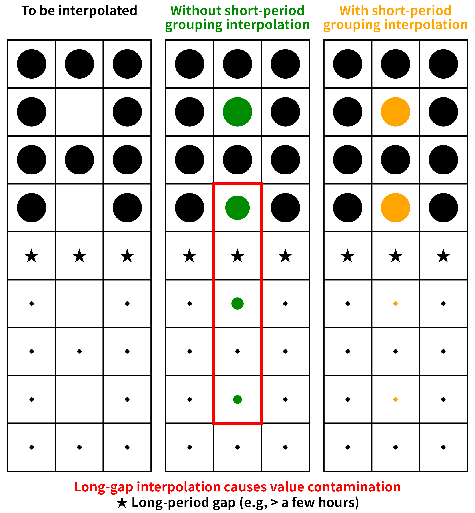

# dataprep 

<div align="right"><sub>logo by Chun-Sheng Liang</sub></div>

> Fast, efficient, and versatile data preprocessing and reshaping tools for R,
> with C++ / OpenMP / SIMD backends.

[](https://github.com/chunshengliang/dataprep/actions/workflows/R-CMD-check.yaml)
[](https://cran.r-project.org/package=dataprep)
[](https://cran.r-project.org/web/checks/check_results_dataprep.html)
[](https://cran.r-project.org/package=dataprep)
[](https://cran.r-project.org/package=dataprep)
[](https://stackoverflow.com/questions/tagged/dataprep)
[](https://deepwiki.com/chunshengliang/dataprep)


## In one paragraph

`dataprep` provides an opinionated, high-performance pipeline for
cleaning tabular and time-series data. The 0.1.7 release rewrites
the cleaning routines in C++ and delivers a speedup over 0.1.5 that
ranges from about **1.0×** (for `varidele` on some full-year data)
to about **1146×** (for `condextr` on full-year Ubuntu data). The
`melt()` and `dcast()` reshaping functions are benchmarked against
every one of the seven major alternatives in the R and Python
ecosystems, at every tested scale (from 1,000 to 100,000,000 rows),
on two reference hosts; the resulting speed-up ranges are
**0.6–2197×** for `melt()` and **2.0–677×** for `dcast()`. On both
hosts the output is **identical** to `reshape2`, `data.table`,
`tidyr`, `pandas`, `polars`, `dask`, and `duckdb`, within
`tol = 1e-12`.

## Why dataprep

`dataprep` provides a coherent, opinionated pipeline for
preprocessing tabular and time-series data:

* **Variable deletion** by missing-value fraction (`varidele`).
* **Observation deletion** by consecutive missing runs (`obsedele`).
* **Outlier removal** by point-by-point weighted conditional
  extremum (`condextr`) or by percentile (`percoutl`).
* **Missing-value imputation** within short periods (`shorvalu`)
  or by linear / LOCF / NOCB / mean / median (`impute_missing`).
* **Fast reshaping** between wide and long formats (`melt`,
  `dcast`) with SIMD + OpenMP.
* **Descriptive statistics, diagnostics, transformation,
  standardization, encoding, validation, and reporting.**
* **Time-series tools**: detrending, diurnal-cycle removal,
  rolling statistics, lags, resampling, decomposition, drift
  detection, day/night and season flags.
* **Fit / transform interfaces** (`prep_fit`, `prep_transform`)
  that prevent data leakage during preprocessing.

Most heavy routines are written in C++ with Rcpp. Since 0.1.7,
many operations are parallelized with OpenMP and vectorized with
AVX2 / AVX-512 when the hardware supports it.

## Design philosophy

The cleaning pipeline is organised around four sequential steps,
each addressing a distinct failure mode of high-resolution
environmental data:

<p align="center">
  
</p>

1. **Variable deletion.** Drop size bins whose missing fraction
   exceeds a threshold, so downstream interpolation never has to
   extrapolate from far-away anchors.
2. **Observation deletion.** Drop rows whose selected columns
   contain a consecutive missing run longer than `half` minutes
   on **both** sides. Every remaining point then has a trustworthy
   anchor within `half` minutes.
3. **Conditional extremum outlier removal.** A single value can
   be a global maximum and still be legitimate, or vice versa.
   `condextr()` judges each candidate in context.

   <div align="center">
     
   </div>

4. **Short-period grouping interpolation.** After steps 1–3,
   remaining `NA`s sit inside short gaps with a valid anchor
   within `half` minutes. `shorvalu()` interpolates within each
   short segment only.

   <div align="center">
     
   </div>

   Interpolating across a long gap silently mixes two physically
   distinct regimes and can create new outliers at the segment
   boundary. Grouping by short segments keeps the interpolation
   local.

Steps 1–4 are wrapped by `dataprep()` for one-call use. The design
reasoning is documented in full in
`vignette("dataprep-philosophy")`. `data1` in this package is the
**already-aggregated** seven-column version of the same dataset;
it is not a useful input for the cleaning pipeline.

## Installation

**Recommended** (also builds the vignettes locally; needs `pandoc`
and the R packages `knitr` and `rmarkdown`):

```r
# install.packages("remotes")
remotes::install_github("chunshengliang/dataprep", build_vignettes = TRUE)
```

**Fallback** (no extra dependencies):

```r
remotes::install_github("chunshengliang/dataprep")
```

The package requires a C++17 compiler (Rtools on Windows,
Xcode / clang on macOS, gcc on Linux). The `build_vignettes = TRUE`
variant additionally needs `pandoc` and the R packages `knitr` and
`rmarkdown`; if any of those is missing, `remotes` will fail. Vignettes
are also available on the package website:
<https://chunshengliang.github.io/dataprep/articles/>.

**Note for Windows users**

When installing from GitHub with `remotes::install_github()`, Windows
users may see:

> Warning: file 'dataprep/configure' did not have execute permissions: corrected
>
> Warning: file 'dataprep/cleanup' did not have execute permissions: corrected

This is expected and harmless. Windows NTFS does not preserve Unix
execute bits, so `R CMD build` corrects them automatically. The
`configure.win` and `cleanup.win` scripts still run, and the package
installs and works normally — **the warning does not affect any
functionality in any way**. Linux, macOS, and CRAN checks do not emit
this warning, and Windows users installing the CRAN binary package
with `install.packages("dataprep")` are not affected either.

## Quick start

```r
library(dataprep)

# The size-bin columns are the ones whose names are numeric
# (1.00, 1.12, ..., 1000). The four non-size columns
# (`date`, `tconc`, `TPNC`, `monthyear`) are excluded by this
# pattern.
size_bins <- grep("^[-+]?[0-9]*\\.?[0-9]+$", names(data))

cleaned <- dataprep(
  data,
  cols       = size_bins,
  group      = 4,        # monthyear
  interval   = 10,
  times      = 10,
  intervals  = 30
)
dim(cleaned)
```

## Performance

`melt()` and `dcast()` are benchmarked against all 7 major
alternatives across 10 shapes and 6 scales (1,000 to
100,000,000 rows). Every cell is measured with a C++ steady-clock
timer and an adaptive `times` rule (20 / 15 / 10 / 5 / 1 iterations
based on warmup time). Two reference hosts were used.


### Reference host A — Ubuntu 25.10

| Component | Value |
|---|---|
| OS | Ubuntu 25.10 (Questing Quokka), kernel 6.17.0-41-generic |
| CPU | 2× AMD EPYC 9965 192-Core Processor (Turin, Zen 5c) |
| Physical cores | 384 (2 × 192) |
| Logical cores | 768 (SMT-2) |
| L1d / L1i | 18 MiB / 12 MiB |
| L2 | 384 MiB |
| L3 | 768 MiB |
| NUMA nodes | 2 |
| RAM | 1.0 TiB (16 × 64 GiB Micron, DDR5-5600, Multi-bit ECC) |
| Max frequency | 3.70 GHz |
| AVX-512 | Full (f, dq, ifma, cd, bw, vl, vbmi, vbmi2, vnni, bitalg, vpopcntdq, bf16) |
| R | 4.5.1 (2025-06-13) |
| Compiler | g++ 15.2.0 |
| reticulate | 1.47.0 |
| data.table | 1.18.6.1 |
| reshape2 | 1.4.5 |
| tidyr | 1.3.2 |
| Python | 3.13.7 |
| pandas | 3.0.6 |
| polars | 1.44.2 (runtime rt64) |
| dask | 2026.8.0 |
| duckdb | 1.5.5 |

### Reference host B — Windows 11 Pro for Workstations

| Component | Value |
|---|---|
| OS | Windows 11 Pro for Workstations, 10.0.26100, Build 26100 |
| CPU | 2× AMD EPYC 7B12 64-Core Processor |
| Physical cores | 128 (2 × 64) |
| Logical cores | 128 (no SMT) |
| L1d / L1i | 4 MiB / 4 MiB |
| L2 | 64 MiB |
| L3 | 512 MiB |
| NUMA nodes | 2 |
| RAM | about 224 GiB (7 × 32 GiB, 2933 MT/s, Micron / Samsung, non-ECC) |
| Max frequency | 2.25 GHz |
| AVX | AVX, AVX2 (no AVX-512) |
| R | 4.6.1 (2026-06-24 ucrt) |
| Compiler | GCC 14.3.0 |
| reticulate | 1.47.0 |
| data.table | 1.18.6.1 |
| reshape2 | 1.4.5 |
| tidyr | 1.3.2 |
| Python | 3.13.15 |
| pandas | 3.0.6 |
| polars | 1.44.2 (runtime rt64) |
| dask | 2026.8.0 |
| duckdb | 1.5.5 |

The two hosts differ in core count, cache size and memory
bandwidth. The relative ranking of the engines is identical on
both; the absolute multipliers scale with the hardware. On a
typical 8–16-core workstation the same comparisons remain within
10–100×.

All numbers below are means in milliseconds. Each cell is
written as `time (speedup×)`, where `time` is the mean for that
engine and `speedup×` is `time / dataprep_time`. The `dataprep`
column itself is the baseline, so it has no multiplier.

### `melt()` — Ubuntu 25.10

**Vary rows, 1 id + 9 value columns**

| rows | dataprep | reshape2 | data.table | tidyr | pandas | polars | dask | duckdb |
|---:|---:|---:|---:|---:|---:|---:|---:|---:|
| 1e3 | 0.164 | 0.372 (2.3×) | 0.244 (1.5×) | 2.698 (16.5×) | 2.095 (12.8×) | 0.703 (4.3×) | 15.131 (92.3×) | 4.366 (26.6×) |
| 1e4 | 0.233 | 0.445 (1.9×) | 0.331 (1.4×) | 3.197 (13.7×) | 2.479 (10.6×) | 0.835 (3.6×) | 15.486 (66.4×) | 10.465 (44.9×) |
| 1e5 | 0.667 | 1.174 (1.8×) | 0.999 (1.5×) | 7.978 (12.0×) | 6.805 (10.2×) | 1.904 (2.9×) | 17.931 (26.9×) | 69.430 (104.0×) |
| 1e6 | 2.177 | 18.031 (8.3×) | 9.444 (4.3×) | 73.345 (33.7×) | 62.328 (28.6×) | 13.234 (6.1×) | 47.444 (21.8×) | 650.287 (298.7×) |
| 1e7 | 26.323 | 368.068 (14.0×) | 363.900 (13.8×) | 1079.493 (41.0×) | 709.694 (27.0×) | 157.963 (6.0×) | 491.043 (18.7×) | 6344.768 (241.0×) |
| 1e8 | 259.022 | 3522.152 (13.6×) | 3508.029 (13.5×) | 12037.801 (46.5×) | 7394.460 (28.5×) | 3088.464 (11.9×) | 4487.400 (17.3×) | 71636.937 (276.6×) |

**Vary rows, 10 id (5 int + 5 chr)**

| rows | dataprep | reshape2 | data.table | tidyr | pandas | polars | dask | duckdb |
|---:|---:|---:|---:|---:|---:|---:|---:|---:|
| 1e3 | 0.229 | 0.543 (2.4×) | 0.400 (1.7×) | 2.894 (12.6×) | 5.448 (23.8×) | 1.066 (4.7×) | 53.506 (233.6×) | 10.375 (45.3×) |
| 1e4 | 0.562 | 2.189 (3.9×) | 1.761 (3.1×) | 4.783 (8.5×) | 6.153 (10.9×) | 1.825 (3.2×) | 53.920 (95.9×) | 48.782 (86.8×) |
| 1e5 | 3.599 | 17.338 (4.8×) | 14.812 (4.1×) | 22.670 (6.3×) | 13.083 (3.6×) | 4.289 (1.2×) | 57.986 (16.1×) | 471.724 (131.1×) |
| 1e6 | 18.653 | 212.030 (11.4×) | 156.515 (8.4×) | 219.428 (11.8×) | 89.268 (4.8×) | 33.021 (1.8×) | 109.259 (5.9×) | 4656.521 (249.6×) |
| 1e7 | 811.193 | 3204.314 (4.0×) | 2674.113 (3.3×) | 3655.460 (4.5×) | 1334.659 (1.6×) | 500.393 (0.6×) | 953.358 (1.2×) | 47794.207 (58.9×) |

**Vary value columns, 1e3 rows, 1 id**

| n_val | dataprep | reshape2 | data.table | tidyr | pandas | polars | dask | duckdb |
|---:|---:|---:|---:|---:|---:|---:|---:|---:|
| 10 | 0.167 | 0.392 (2.3×) | 0.249 (1.5×) | 2.705 (16.2×) | 2.091 (12.5×) | 0.579 (3.5×) | 15.589 (93.4×) | 4.980 (29.8×) |
| 100 | 0.255 | 1.104 (4.3×) | 0.362 (1.4×) | 3.726 (14.6×) | 6.463 (25.3×) | 0.783 (3.1×) | 48.917 (191.6×) | 20.743 (81.2×) |
| 1000 | 0.810 | 8.027 (9.9×) | 1.201 (1.5×) | 11.733 (14.5×) | 48.145 (59.4×) | 2.800 (3.5×) | 381.540 (471.1×) | 173.686 (214.4×) |
| 10000 | 2.026 | 91.112 (45.0×) | 12.841 (6.3×) | 102.550 (50.6×) | 495.632 (244.7×) | 20.448 (10.1×) | 4450.699 (2197.2×) | 1917.203 (946.5×) |

**Vary value columns, 1e3 rows, 10 id**

| n_val | dataprep | reshape2 | data.table | tidyr | pandas | polars | dask | duckdb |
|---:|---:|---:|---:|---:|---:|---:|---:|---:|
| 10 | 0.244 | 0.561 (2.3×) | 0.422 (1.7×) | 2.926 (12.0×) | 5.642 (23.1×) | 1.097 (4.5×) | 52.566 (215.2×) | 11.455 (46.9×) |
| 100 | 0.526 | 2.878 (5.5×) | 1.940 (3.7×) | 5.275 (10.0×) | 20.608 (39.2×) | 2.028 (3.9×) | 225.567 (429.2×) | 61.420 (116.9×) |
| 1000 | 4.039 | 25.503 (6.3×) | 16.669 (4.1×) | 28.220 (7.0×) | 168.101 (41.6×) | 6.791 (1.7×) | 2130.133 (527.4×) | 564.126 (139.7×) |
| 10000 | 23.030 | 318.444 (13.8×) | 181.472 (7.9×) | 278.753 (12.1×) | 1789.076 (77.7×) | 61.271 (2.7×) | 20808.858 (903.6×) | 5747.896 (249.6×) |

### `melt()` — Windows 11 Pro for Workstations

**Vary rows, 1 id + 9 value columns**

| rows | dataprep | reshape2 | data.table | tidyr | pandas | polars | dask | duckdb |
|---:|---:|---:|---:|---:|---:|---:|---:|---:|
| 1e3 | 0.306 | 0.638 (2.1×) | 0.448 (1.5×) | 4.064 (13.3×) | 3.420 (11.2×) | 0.538 (1.8×) | 29.186 (95.2×) | 7.828 (25.5×) |
| 1e4 | 0.483 | 0.903 (1.9×) | 0.734 (1.5×) | 5.007 (10.4×) | 4.857 (10.1×) | 0.797 (1.7×) | 29.926 (62.0×) | 23.092 (47.8×) |
| 1e5 | 2.690 | 3.797 (1.4×) | 3.381 (1.3×) | 17.132 (6.4×) | 22.881 (8.5×) | 3.725 (1.4×) | 45.735 (17.0×) | 180.649 (67.2×) |
| 1e6 | 12.414 | 26.406 (2.1×) | 26.623 (2.1×) | 193.073 (15.6×) | 193.283 (15.6×) | 24.984 (2.0×) | 197.627 (15.9×) | 1458.473 (117.5×) |
| 1e7 | 159.654 | 314.406 (2.0×) | 322.484 (2.0×) | 1871.675 (11.7×) | 2016.507 (12.6×) | 251.983 (1.6×) | 1761.710 (11.0×) | 14561.307 (91.2×) |
| 1e8 | 1081.994 | 2596.127 (2.4×) | 2629.491 (2.4×) | 17211.577 (15.9×) | 20196.679 (18.7×) | 4705.301 (4.3×) | 14989.606 (13.9×) | 149796.139 (138.4×) |

**Vary rows, 10 id (5 int + 5 chr)**

| rows | dataprep | reshape2 | data.table | tidyr | pandas | polars | dask | duckdb |
|---:|---:|---:|---:|---:|---:|---:|---:|---:|
| 1e3 | 0.506 | 1.131 (2.2×) | 0.848 (1.7×) | 4.521 (8.9×) | 11.282 (22.3×) | 1.263 (2.5×) | 97.726 (193.2×) | 21.775 (43.0×) |
| 1e4 | 1.591 | 4.807 (3.0×) | 3.479 (2.2×) | 8.393 (5.3×) | 14.679 (9.2×) | 2.242 (1.4×) | 103.377 (65.0×) | 110.031 (69.2×) |
| 1e5 | 14.388 | 41.408 (2.9×) | 28.350 (2.0×) | 46.071 (3.2×) | 45.080 (3.1×) | 10.817 (0.8×) | 133.017 (9.2×) | 996.675 (69.3×) |
| 1e6 | 94.441 | 422.005 (4.5×) | 279.172 (3.0×) | 443.575 (4.7×) | 325.483 (3.4×) | 101.768 (1.1×) | 376.744 (4.0×) | 9698.458 (102.7×) |
| 1e7 | 957.280 | 4283.333 (4.5×) | 2736.284 (2.9×) | 4885.442 (5.1×) | 3246.495 (3.4×) | 1048.586 (1.1×) | 2846.474 (3.0×) | 98876.869 (103.3×) |

**Vary value columns, 1e3 rows, 1 id**

| n_val | dataprep | reshape2 | data.table | tidyr | pandas | polars | dask | duckdb |
|---:|---:|---:|---:|---:|---:|---:|---:|---:|
| 10 | 0.407 | 0.745 (1.8×) | 0.585 (1.4×) | 4.372 (10.7×) | 4.215 (10.4×) | 0.583 (1.4×) | 28.410 (69.8×) | 10.143 (24.9×) |
| 100 | 0.830 | 2.332 (2.8×) | 1.079 (1.3×) | 6.041 (7.3×) | 46.832 (56.5×) | 217.136 (261.8×) | 111.534 (134.5×) | 49.581 (59.8×) |
| 1000 | 3.854 | 16.041 (4.2×) | 3.950 (1.0×) | 26.502 (6.9×) | 141.405 (36.7×) | 4.332 (1.1×) | 961.776 (249.6×) | 461.652 (119.8×) |
| 10000 | 12.848 | 172.965 (13.5×) | 36.763 (2.9×) | 213.030 (16.6×) | 1405.853 (109.4×) | 38.241 (3.0×) | 10372.086 (807.3×) | 5060.629 (393.9×) |

**Vary value columns, 1e3 rows, 10 id**

| n_val | dataprep | reshape2 | data.table | tidyr | pandas | polars | dask | duckdb |
|---:|---:|---:|---:|---:|---:|---:|---:|---:|
| 10 | 0.480 | 1.186 (2.5×) | 0.873 (1.8×) | 4.615 (9.6×) | 11.939 (24.9×) | 1.261 (2.6×) | 103.220 (214.9×) | 24.181 (50.3×) |
| 100 | 1.663 | 6.647 (4.0×) | 3.619 (2.2×) | 9.429 (5.7×) | 58.083 (34.9×) | 2.905 (1.7×) | 502.474 (302.2×) | 135.155 (81.3×) |
| 1000 | 17.137 | 55.558 (3.2×) | 31.872 (1.9×) | 56.418 (3.3×) | 518.748 (30.3×) | 15.320 (0.9×) | 4784.479 (279.2×) | 1291.982 (75.4×) |
| 10000 | 105.350 | 574.994 (5.5×) | 349.719 (3.3×) | 576.305 (5.5×) | 5631.684 (53.5×) | 132.502 (1.3×) | 54112.865 (513.6×) | 13485.024 (128.0×) |

### `dcast()` — Ubuntu 25.10

**Vary n_long, 1 id, 10 levels**

| n_long | dataprep | reshape2 | data.table | tidyr | pandas | polars | dask | duckdb |
|---:|---:|---:|---:|---:|---:|---:|---:|---:|
| 1e3 | 0.838 | 1.699 (2.0×) | 1.794 (2.1×) | 4.087 (4.9×) | 1.869 (2.2×) | 64.712 (77.2×) | 8.259 (9.9×) | 7.244 (8.6×) |
| 1e4 | 0.858 | 2.584 (3.0×) | 2.592 (3.0×) | 4.422 (5.2×) | 2.314 (2.7×) | 66.390 (77.4×) | 8.814 (10.3×) | 10.341 (12.1×) |
| 1e5 | 1.008 | 19.901 (19.7×) | 14.270 (14.2×) | 7.671 (7.6×) | 6.738 (6.7×) | 63.669 (63.2×) | 16.159 (16.0×) | 35.706 (35.4×) |
| 1e6 | 1.760 | 151.497 (86.1×) | 344.820 (196.0×) | 49.973 (28.4×) | 58.741 (33.4×) | 109.993 (62.5×) | 81.242 (46.2×) | 160.831 (91.4×) |
| 1e7 | 7.457 | 1852.872 (248.5×) | 580.994 (77.9×) | 718.827 (96.4×) | 780.511 (104.7×) | 314.969 (42.2×) | 961.602 (128.9×) | 1682.043 (225.6×) |
| 1e8 | 97.860 | 22091.756 (225.7×) | 18956.133 (193.7×) | 9897.783 (101.1×) | 10686.355 (109.2×) | 2378.465 (24.3×) | 13470.390 (137.7×) | 17039.024 (174.1×) |

**Vary levels, 1 id, 1e6 rows**

| levels | dataprep | reshape2 | data.table | tidyr | pandas | polars | dask | duckdb |
|---:|---:|---:|---:|---:|---:|---:|---:|---:|
| 10 | 1.760 | 151.497 (86.1×) | 344.820 (196.0×) | 49.973 (28.4×) | 58.741 (33.4×) | 109.993 (62.5×) | 81.242 (46.2×) | 160.831 (91.4×) |
| 100 | 1.362 | 100.167 (73.5×) | 353.876 (259.8×) | 43.134 (31.7×) | 53.645 (39.4×) | 179.944 (132.1×) | 74.103 (54.4×) | 177.384 (130.2×) |
| 1000 | 1.859 | 99.793 (53.7×) | 335.939 (180.7×) | 44.074 (23.7×) | 55.423 (29.8×) | 203.755 (109.6×) | 75.738 (40.7×) | 196.444 (105.6×) |
| 10000 | 11.197 | 128.396 (11.5×) | 533.499 (47.6×) | 55.436 (5.0×) | 59.201 (5.3×) | 321.541 (28.7×) | 79.903 (7.1×) | 490.346 (43.8×) |

**Vary n_long, 1 id, 100 levels**

| n_long | dataprep | reshape2 | data.table | tidyr | pandas | polars | dask | duckdb |
|---:|---:|---:|---:|---:|---:|---:|---:|---:|
| 1e4 | 0.992 | 2.739 (2.8×) | 2.777 (2.8×) | 4.569 (4.6×) | 2.509 (2.5×) | 46.744 (47.1×) | 9.281 (9.4×) | 14.178 (14.3×) |
| 1e5 | 1.080 | 18.386 (17.0×) | 8.541 (7.9×) | 7.808 (7.2×) | 6.635 (6.1×) | 64.753 (59.9×) | 14.849 (13.7×) | 42.541 (39.4×) |
| 1e6 | 1.362 | 100.167 (73.5×) | 353.876 (259.8×) | 43.134 (31.7×) | 53.645 (39.4×) | 179.944 (132.1×) | 74.103 (54.4×) | 177.384 (130.2×) |
| 1e7 | 4.354 | 1840.332 (422.6×) | 631.070 (144.9×) | 623.314 (143.1×) | 789.977 (181.4×) | 496.461 (114.0×) | 986.938 (226.6×) | 1701.048 (390.6×) |
| 1e8 | 43.842 | 16612.906 (378.9×) | 17668.158 (403.0×) | 8528.194 (194.5×) | 9963.530 (227.3×) | 2452.894 (55.9×) | 12286.978 (280.3×) | 17476.822 (398.6×) |

**Vary n_id, 1e6 rows, 10 levels**

| n_id | dataprep | reshape2 | data.table | tidyr | pandas | polars | dask | duckdb |
|---:|---:|---:|---:|---:|---:|---:|---:|---:|
| 1 | 1.760 | 151.497 (86.1×) | 344.820 (196.0×) | 49.973 (28.4×) | 58.741 (33.4×) | 109.993 (62.5×) | 81.242 (46.2×) | 160.831 (91.4×) |
| 2 | 1.882 | 201.356 (107.0×) | 375.490 (199.5×) | 54.298 (28.8×) | 79.881 (42.4×) | 122.078 (64.9×) | 106.899 (56.8×) | 284.290 (151.0×) |
| 10 | 3.377 | 1214.021 (359.5×) | 485.386 (143.7×) | 84.796 (25.1×) | 187.125 (55.4×) | 127.203 (37.7×) | 242.001 (71.7×) | 914.026 (270.6×) |
| 100 | 19.733 | 10485.868 (531.4×) | 797.361 (40.4×) | 402.418 (20.4×) | 1321.065 (66.9×) | 146.569 (7.4×) | 1686.926 (85.5×) | 8214.293 (416.3×) |

### `dcast()` — Windows 11 Pro for Workstations

**Vary n_long, 1 id, 10 levels**

| n_long | dataprep | reshape2 | data.table | tidyr | pandas | polars | dask | duckdb |
|---:|---:|---:|---:|---:|---:|---:|---:|---:|
| 1e3 | 0.411 | 2.447 (6.0×) | 3.663 (8.9×) | 6.446 (15.7×) | 2.819 (6.9×) | 5.609 (13.7×) | 14.901 (36.3×) | 18.838 (45.8×) |
| 1e4 | 0.561 | 4.352 (7.8×) | 8.541 (15.2×) | 8.168 (14.6×) | 5.056 (9.0×) | 7.470 (13.3×) | 18.053 (32.2×) | 23.505 (41.9×) |
| 1e5 | 1.076 | 31.478 (29.3×) | 39.110 (36.4×) | 14.097 (13.1×) | 20.435 (19.0×) | 15.394 (14.3×) | 41.224 (38.3×) | 73.388 (68.2×) |
| 1e6 | 3.452 | 296.568 (85.9×) | 146.564 (42.5×) | 99.476 (28.8×) | 248.761 (72.1×) | 65.200 (18.9×) | 341.027 (98.8×) | 385.068 (111.6×) |
| 1e7 | 24.787 | 2864.941 (115.6×) | 1041.879 (42.0×) | 1528.987 (61.7×) | 2549.284 (102.8×) | 555.367 (22.4×) | 3344.242 (134.9×) | 3521.290 (142.1×) |
| 1e8 | 219.750 | 29775.789 (135.5×) | 13401.225 (61.0×) | 16399.642 (74.6×) | 31762.248 (144.5×) | 5564.739 (25.3×) | 39105.868 (178.0×) | 34107.019 (155.2×) |

**Vary levels, 1 id, 1e6 rows**

| levels | dataprep | reshape2 | data.table | tidyr | pandas | polars | dask | duckdb |
|---:|---:|---:|---:|---:|---:|---:|---:|---:|
| 10 | 3.452 | 296.568 (85.9×) | 146.564 (42.5×) | 99.476 (28.8×) | 248.761 (72.1×) | 65.200 (18.9×) | 341.027 (98.8×) | 385.068 (111.6×) |
| 100 | 4.229 | 174.438 (41.2×) | 181.993 (43.0×) | 91.899 (21.7×) | 248.562 (58.8×) | 88.165 (20.8×) | 329.288 (77.9×) | 808.286 (191.1×) |
| 1000 | 5.454 | 170.007 (31.2×) | 170.607 (31.3×) | 90.087 (16.5×) | 257.311 (47.2×) | 304.129 (55.8×) | 322.657 (59.2×) | 1129.586 (207.1×) |
| 10000 | 32.125 | 254.416 (7.9×) | 193.725 (6.0×) | 138.006 (4.3×) | 250.750 (7.8×) | 2069.130 (64.4×) | 351.603 (10.9×) | 14037.759 (437.0×) |

**Vary n_long, 1 id, 100 levels**

| n_long | dataprep | reshape2 | data.table | tidyr | pandas | polars | dask | duckdb |
|---:|---:|---:|---:|---:|---:|---:|---:|---:|
| 1e4 | 0.573 | 4.870 (8.5×) | 9.075 (15.8×) | 8.774 (15.3×) | 5.350 (9.3×) | 11.534 (20.1×) | 18.621 (32.5×) | 88.427 (154.4×) |
| 1e5 | 0.920 | 33.562 (36.5×) | 42.152 (45.8×) | 18.442 (20.1×) | 34.785 (37.8×) | 18.178 (19.8×) | 63.364 (68.9×) | 281.700 (306.3×) |
| 1e6 | 4.229 | 174.438 (41.2×) | 181.993 (43.0×) | 91.899 (21.7×) | 248.562 (58.8×) | 88.165 (20.8×) | 329.288 (77.9×) | 808.286 (191.1×) |
| 1e7 | 34.596 | 3130.501 (90.5×) | 1109.646 (32.1×) | 1340.192 (38.7×) | 2345.418 (67.8×) | 1111.499 (32.1×) | 3133.278 (90.6×) | 7377.747 (213.3×) |
| 1e8 | 120.830 | 24115.628 (199.6×) | 14914.904 (123.4×) | 14148.150 (117.1×) | 26487.805 (219.2×) | 8239.811 (68.2×) | 33408.904 (276.5×) | 81803.327 (677.0×) |

**Vary n_id, 1e6 rows, 10 levels**

| n_id | dataprep | reshape2 | data.table | tidyr | pandas | polars | dask | duckdb |
|---:|---:|---:|---:|---:|---:|---:|---:|---:|
| 1 | 3.452 | 296.568 (85.9×) | 146.564 (42.5×) | 99.476 (28.8×) | 248.761 (72.1×) | 65.200 (18.9×) | 341.027 (98.8×) | 385.068 (111.6×) |
| 2 | 9.561 | 383.313 (40.1×) | 207.532 (21.7×) | 119.882 (12.5×) | 401.175 (42.0×) | 83.631 (8.7×) | 486.630 (50.9×) | 672.731 (70.4×) |
| 10 | 15.827 | 2677.380 (169.2×) | 365.816 (23.1×) | 186.221 (11.8×) | 906.928 (57.3×) | 93.757 (5.9×) | 1109.067 (70.1×) | 1903.762 (120.3×) |
| 100 | 72.347 | 24036.087 (332.2×) | 1033.295 (14.3×) | 724.565 (10.0×) | 6952.087 (96.1×) | 251.811 (3.5×) | 8300.249 (114.7×) | 16128.655 (222.9×) |

### Summary of speedups

Speedup is defined as `competitor mean / dataprep mean`.
Each table summarises every benchmark cell on that host, across all
seven competitors (`reshape2`, `data.table`, `tidyr`, `pandas`,
`polars`, `dask`, `duckdb`). Cell labels are written as
`n_rows × n_cols × n_id × n_val` for `melt()` and
`n_long × n_id × n_levels` for `dcast()`.

**Ubuntu 25.10**

| Operation | Min | Median | Mean | Max |
|---|---:|---:|---:|---:|
| `melt()`  | 0.6× (polars @ 1e7 × 19 × 10 × 9) | 12.0× | 77.9× | 2197.2× (dask @ 1e3 × 10001 × 1 × 10000) |
| `dcast()` | 2.0× (reshape2 @ 1e3 × 1 × 10)    | 54.0× | 96.5× | 531.4× (reshape2 @ 1e6 × 100 × 10)        |

**Windows 11 Pro for Workstations**

| Operation | Min | Median | Mean | Max |
|---|---:|---:|---:|---:|
| `melt()`  | 0.8× (polars @ 1e5 × 19 × 10 × 9) | 5.7× | 44.4× | 807.3× (dask @ 1e3 × 10001 × 1 × 10000) |
| `dcast()` | 3.5× (polars @ 1e6 × 100 × 10)   | 41.6× | 74.3× | 677.0× (duckdb @ 1e8 × 1 × 100) |

Combined across both hosts, the smallest speedups remain at
0.6–0.8× (`melt()` at 1e5 and 1e7 rows), while the largest reach
2197× for `melt()` and 677× for `dcast()`. The mean speedup is above
44× for `melt()` and above 74× for `dcast()` on both hosts. On the
largest cells (1e8 rows, 8 GB of input), `dataprep` is the only engine
that completes within 2 s, specifically < 0.5 s on Ubuntu and
< 1.3 s on Windows.

Complete tables — including mean, median, and the full
per-competitor gradient — are in
`vignette("dataprep-performance")`.

## Cross-engine consistency

`melt()` and `dcast()` produce output identical to `reshape2`,
`data.table`, `tidyr`, `pandas`, `polars`, `dask`, and `duckdb` on
every tested shape, within `tol = 1e-12`:

| Operation | Cells tested | Engines | Pairwise |
|---|---:|---:|---|
| `melt` | 4 shapes | 8 | all consistent |
| `dcast` | 4 shapes | 8 | all consistent |

Reproducible scripts ship under `inst/` and are disabled by
default so that `R CMD check` does not run them. A single script,
`benchmark_melt_dcast.R`, runs both the per-tool benchmarks and the
8-engine consistency checks:

```r
Sys.setenv(DATAPREP_RUN_BENCHMARK = "1")
source(system.file("benchmark_melt_dcast.R", package = "dataprep"))
```

## When not to preprocess

The pipeline above assumes that the input is high-resolution
instrument data with intermittent gaps and occasional outliers.
Three cases where you should not run the full pipeline:

1. **Already-aggregated data.** `data1` in this package is the
   result of aggregating the 61 size bins of `data` into three
   modes. It has no long gaps and no obvious outliers, so
   `varidele`, `obsedele`, `condextr`, and `shorvalu` have nothing
   to do.
2. **Models that tolerate missing values.** Gradient boosting,
   random forests, and XGBoost handle `NA` natively.
3. **Gaps shorter than the physical mixing time.** When the
   aerosol is well-mixed, a few missing points can be interpolated
   with negligible error.

See `vignette("dataprep-philosophy")` for the full reasoning.

## Function overview

### Cleaning

* `varidele()` — remove variables by missing fraction
* `obsedele()` — remove observations by consecutive missing runs
* `condextr()` — point-by-point weighted conditional extremum
* `percoutl()` — traditional percentile removal
* `detect_outliers()` — IQR / MAD / percentile masks
* `winsorize()` — cap extreme values
* `phys_filter()` — physical range filter
* `filter_high_cor()` / `filter_low_var()` — variable selection
* `deduplicate()` — exact / fuzzy duplicate removal
* `validate_data()` — rule-based validation
* `balance_panel()` — panel balancing

### Missing values and imputation

* `na_diagnose()` — NA run statistics
* `impute_missing()` — linear / LOCF / NOCB / mean / median
* `shorvalu()` — short-period linear interpolation

### Transformation

* `transform_data()` — log / sqrt / Box-Cox / Yeo-Johnson,
  z-score / min-max / robust
* `log_returns()` — log returns
* `bin_data()` — equal-width / equal-frequency / custom binning
* `encode_categorical()` — label / frequency / one-hot

### Time series

* `create_lags()` — grouped lag / lead columns
* `roll_apply()` — rolling statistics
* `resample_time()` — resample to hour / day / month
* `detrend_ts()` — linear detrending
* `remove_diurnal_cycle()` — subtract mean diurnal cycle
* `decompose_ts()` — additive / multiplicative decomposition
* `drift_detect()` — rolling drift detection
* `day_night_flag()` / `season_flag()` — time flags

### Reshaping

* `melt()` — wide to long, SIMD + OpenMP backend
* `dcast()` — long to wide, block-path strided copy

### Workflow and reporting

* `descdata()` / `descplot()` — descriptive statistics
* `percdata()` / `percplot()` — percentile summaries
* `data_report()` — compact data quality report
* `dry_run()` — simulate preprocessing
* `prep_fit()` / `prep_transform()` — fit / transform pipeline
* `sample_data()` — stratified sampling

## Documentation

* **Design philosophy and preprocessing methodology** — why the
  pipeline has the shape it does.
* **Cleaning pipeline** — step-by-step walkthrough of `varidele` /
  `obsedele` / `condextr` / `shorvalu`.
* **Performance and cross-engine consistency** — full
  benchmark tables and consistency checks.
* **Upgrading from 0.1.5 to 0.1.7** — behaviour changes
  and migration checklist.
* **Leakage-free workflow** — `prep_fit()` / `prep_transform()`.
* **Fast reshaping with `melt()` and `dcast()`**.
* **Descriptive statistics and plots**.
* **Function reference**.
* **Changelog**.

## Funding

This work was supported by the National Natural Science Foundation
of China (No. 12301674).

## Citation

If you use dataprep in published work, please cite:

> Liang, C.-S., Wu, H., Li, H.-Y., Zhang, Q., Li, Z. & He, K.-B.
> (2020). Efficient data preprocessing, episode classification, and
> source apportionment of particle number concentrations.
> *Science of the Total Environment*, 741, 140923.
> https://doi.org/10.1016/j.scitotenv.2020.140923

## License

GPL (>= 2)
