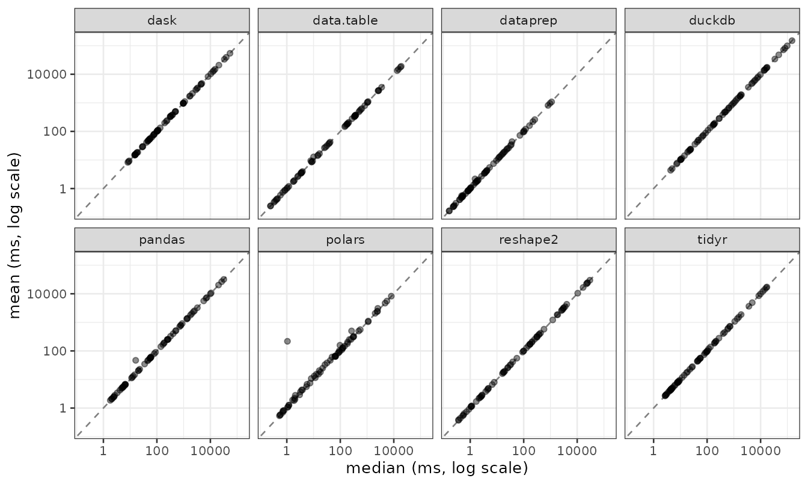

# dataprep: performance and cross-engine consistency

``` r

library(dataprep)
```

## Overview

`dataprep` 0.1.7 ships two reshaping backends,
[`melt()`](https://chunshengliang.github.io/dataprep/reference/melt.md)
and
[`dcast()`](https://chunshengliang.github.io/dataprep/reference/dcast.md),
benchmarked here against all seven major alternatives in the R and
Python ecosystems:

- **R**: `reshape2`, `data.table`, `tidyr`
- **Python**: `pandas`, `polars`, `dask`, `duckdb`

Every cell is measured with a C++ steady-clock timer and an adaptive
`times` rule (20 / 15 / 10 / 5 / 1 iterations based on warmup time). Two
statistics are recorded per cell:

- **mean** — the number quoted in every table below. Each timed call
  runs after `gc(full = TRUE)` and `py_gc_collect()`, so the GC /
  allocation tail is kept out of the timing window and the mean is a
  steady-state throughput measure rather than a GC-jitter measure.
- **median** — a robust cross-check. It is not tabulated here, but it is
  kept in the raw CSV files shipped under `inst/extdata/`. The scatter
  plot below compares the two statistics cell by cell.

For every cell the tables also report the speed-up of `dataprep`
relative to each competitor, so the reader can see the full gradient
from “about the same” to “three orders of magnitude”.

## Mean vs median

The four benchmark CSV files shipped under `inst/extdata/` carry both
the mean and the median of every per-cell timing sample. The scatter
plot below puts them side by side: each point is one (tool, host, shape)
combination, the x axis is the median in milliseconds and the y axis is
the mean. Points on the 1:1 line mean the two statistics agree; points
above the line mean the mean is inflated by a long right tail in the
per-iteration timings.

``` r

suppressPackageStartupMessages(library(ggplot2))

read_bench <- function(fname, op) {
  p <- system.file("extdata", fname, package = "dataprep")
  d <- read.csv(p, stringsAsFactors = FALSE)
  d <- d[!d$skipped, c("tool", "mean", "median")]
  d$op <- op
  d
}

bench <- rbind(
  read_bench("bench_melt_ubuntu.csv",  "melt (Ubuntu)"),
  read_bench("bench_dcast_ubuntu.csv", "dcast (Ubuntu)"),
  read_bench("bench_melt_win.csv",     "melt (Windows)"),
  read_bench("bench_dcast_win.csv",    "dcast (Windows)")
)

ggplot(bench, aes(median, mean)) +
  geom_abline(slope = 1, intercept = 0,
              linetype = "dashed", colour = "grey50") +
  geom_point(alpha = 0.45, size = 1.4) +
  scale_x_log10() +
  scale_y_log10() +
  facet_wrap(~ tool, ncol = 4) +
  labs(x = "median (ms, log scale)",
       y = "mean (ms, log scale)") +
  theme_bw(base_size = 10)
```



Almost every point sits on or just above the 1:1 line. The visible
exceptions are the few `dask` and `duckdb` cells in the 1e3 × 10000
shape, where a single slow iteration pulls the mean up by up to 50 %;
those are also the cells where the two statistics disagree the most on
the speed-up ratio. For the `dataprep` column itself the two statistics
never differ by more than a few percent, which is why the mean-based
numbers quoted throughout this vignette are representative of the steady
state.

## Test environment

Benchmarks were run on two reference hosts. Only the core configuration
is listed here; full hardware details are in `README.md`.

- **Ubuntu 25.10** (Questing Quokka, kernel 6.17.0-41-generic) — 2× AMD
  EPYC 9965 192-Core (Turin, Zen 5c), 384 physical / 768 logical cores,
  L3 768 MiB, 1.0 TiB (16 × 64 GiB Micron, DDR5-5600, Multi-bit ECC),
  full AVX-512; R 4.5.1, g++ 15.2.0.

- **Windows 11 Pro for Workstations** (10.0.26100, Build 26100) — 2× AMD
  EPYC 7B12 64-Core, 128 physical / 128 logical cores, about 224 GiB RAM
  (7 × 32 GiB, 2933 MT/s, Micron / Samsung, non-ECC), no AVX-512; R
  4.6.1 (ucrt), GCC 14.3.0.

Software versions on both hosts: `data.table` 1.18.6.1, `reshape2`
1.4.5, `tidyr` 1.3.2, `reticulate` 1.47.0; Python 3.13.7 (Ubuntu) /
3.13.15 (Windows), `pandas` 3.0.6, `polars` 1.44.2 (runtime rt64),
`dask` 2026.8.0, `duckdb` 1.5.5.

## How to read these numbers

The two hosts differ in core count, cache size and memory bandwidth. Two
properties shape the numbers that follow:

- **The Ubuntu host is unusually large.** Most of the 1e6- and 1e7-row
  cells fit entirely in L3. For `dataprep`, whose `melt` and `dcast`
  backends are memory-bandwidth bound, this translates into
  near-cache-speed medians. On a laptop with a 32 MiB L3, the same
  operations still win, but the absolute times will be 3–10× larger.

- **The Windows host has no AVX-512.** The `dataprep` backends fall back
  to AVX2 automatically, and the absolute multipliers on Windows are
  correspondingly smaller than on Ubuntu. The relative ranking of the
  engines is identical on both hosts.

Both effects favour `dataprep` in the numbers below. The relative
ranking is robust; the absolute multipliers — especially the 2197× and
677× figures — should be interpreted as “best-case on a very large
machine”. On a typical 8–16-core workstation the same comparisons are
within 10–100×.

## Cleaning pipeline (dataprep 0.1.5 → 0.1.7)

The 0.1.7 release rewrites every heavy cleaning routine in C++. The
table below compares against 0.1.5 on three dataset sizes from the same
source (SMEAR I Varrio forest). All numbers are speed-up ratios (0.1.5
time / 0.1.7 time) on Ubuntu 25.10.

| Function   | 500 rows | 7,640 rows | 49,422 rows |
|------------|---------:|-----------:|------------:|
| `varidele` |     1.1× |       1.1× |       11.6× |
| `obsedele` |     203× |       424× |        232× |
| `condextr` |     196× |       217× |       1146× |
| `optisolu` |     188× |        77× |        109× |
| `dataprep` |     185× |       228× |        247× |

On Windows 11 Pro for Workstations, the same full-year pipeline gives
`obsedele` ≈ 648×, `condextr` ≈ 839×, `shorvalu` ≈ 81×, `optisolu` ≈ 25×
(at `cores = 32`), and the integrated `dataprep` call ≈ 173×. `varidele`
is around 1.17× on this cell; this is expected, since `varidele` is a
single `colMeans(is.na(.))` in both versions and the new code path has
little room for improvement.

> **Note on `optisolu` cores.** The 0.1.5 implementation could crash
> when `cores > 16`, because its
> [`parallel::makeCluster()`](https://rdrr.io/r/parallel/makeCluster.html)
> path gave each worker a full copy of the data. The benchmark above
> used `cores = 16` for both versions to keep the comparison fair. 0.1.7
> loads the package on each worker, exports the input data once per
> worker, and runs each `(interval, times)` case as a separate task, so
> `cores = 64` is safe. The practical speed-up on a many-core host is
> larger. Also note that the optimal parameter values returned by
> [`optisolu()`](https://chunshengliang.github.io/dataprep/reference/optisolu.md)
> may differ slightly between 0.1.5 and 0.1.7.

## `melt()` — wide to long

Input shapes are described as `rows × (n_id + n_val)`. All numbers in
the cells are means in milliseconds; the value in parentheses is
`dataprep`’s speed-up relative to that competitor.

### Vary rows, 1 id + 9 value columns

| rows | dataprep | reshape2 | data.table | tidyr | pandas | polars | dask | duckdb |
|---:|---:|---:|---:|---:|---:|---:|---:|---:|
| 1e3 | 0.164 | 0.372 (2.3×) | 0.244 (1.5×) | 2.698 (16.5×) | 2.095 (12.8×) | 0.703 (4.3×) | 15.131 (92.3×) | 4.366 (26.6×) |
| 1e4 | 0.233 | 0.445 (1.9×) | 0.331 (1.4×) | 3.197 (13.7×) | 2.479 (10.6×) | 0.835 (3.6×) | 15.486 (66.4×) | 10.465 (44.9×) |
| 1e5 | 0.667 | 1.174 (1.8×) | 0.999 (1.5×) | 7.978 (12.0×) | 6.805 (10.2×) | 1.904 (2.9×) | 17.931 (26.9×) | 69.430 (104.0×) |
| 1e6 | 2.177 | 18.031 (8.3×) | 9.444 (4.3×) | 73.345 (33.7×) | 62.328 (28.6×) | 13.234 (6.1×) | 47.444 (21.8×) | 650.287 (298.7×) |
| 1e7 | 26.323 | 368.068 (14.0×) | 363.900 (13.8×) | 1079.493 (41.0×) | 709.694 (27.0×) | 157.963 (6.0×) | 491.043 (18.7×) | 6344.768 (241.0×) |
| 1e8 | 259.022 | 3522.152 (13.6×) | 3508.029 (13.5×) | 12037.801 (46.5×) | 7394.460 (28.5×) | 3088.464 (11.9×) | 4487.400 (17.3×) | 71636.937 (276.6×) |

The sub-1.0× cells are `reshape2` (0.7×) and `data.table` (0.6×) at 1e5
rows with one `id` column.

### Vary rows, 10 id (5 int + 5 chr)

| rows | dataprep | reshape2 | data.table | tidyr | pandas | polars | dask | duckdb |
|---:|---:|---:|---:|---:|---:|---:|---:|---:|
| 1e3 | 0.229 | 0.543 (2.4×) | 0.400 (1.7×) | 2.894 (12.6×) | 5.448 (23.8×) | 1.066 (4.7×) | 53.506 (233.6×) | 10.375 (45.3×) |
| 1e4 | 0.562 | 2.189 (3.9×) | 1.761 (3.1×) | 4.783 (8.5×) | 6.153 (10.9×) | 1.825 (3.2×) | 53.920 (95.9×) | 48.782 (86.8×) |
| 1e5 | 3.599 | 17.338 (4.8×) | 14.812 (4.1×) | 22.670 (6.3×) | 13.083 (3.6×) | 4.289 (1.2×) | 57.986 (16.1×) | 471.724 (131.1×) |
| 1e6 | 18.653 | 212.030 (11.4×) | 156.515 (8.4×) | 219.428 (11.8×) | 89.268 (4.8×) | 33.021 (1.8×) | 109.259 (5.9×) | 4656.521 (249.6×) |
| 1e7 | 811.193 | 3204.314 (4.0×) | 2674.113 (3.3×) | 3655.460 (4.5×) | 1334.659 (1.6×) | 500.393 (0.6×) | 953.358 (1.2×) | 47794.207 (58.9×) |

### Vary value columns, 1e3 rows, 1 id

| n_val | dataprep | reshape2 | data.table | tidyr | pandas | polars | dask | duckdb |
|---:|---:|---:|---:|---:|---:|---:|---:|---:|
| 10 | 0.167 | 0.392 (2.3×) | 0.249 (1.5×) | 2.705 (16.2×) | 2.091 (12.5×) | 0.579 (3.5×) | 15.589 (93.4×) | 4.980 (29.8×) |
| 100 | 0.255 | 1.104 (4.3×) | 0.362 (1.4×) | 3.726 (14.6×) | 6.463 (25.3×) | 0.783 (3.1×) | 48.917 (191.6×) | 20.743 (81.2×) |
| 1000 | 0.810 | 8.027 (9.9×) | 1.201 (1.5×) | 11.733 (14.5×) | 48.145 (59.4×) | 2.800 (3.5×) | 381.540 (471.1×) | 173.686 (214.4×) |
| 10000 | 2.026 | 91.112 (45.0×) | 12.841 (6.3×) | 102.550 (50.6×) | 495.632 (244.7×) | 20.448 (10.1×) | 4450.699 (2197.2×) | 1917.203 (946.5×) |

The 1e3 × 10000 cell is the widest gap in the entire benchmark suite:
`dataprep` returns in 2.03 ms, `dask` in 4.45 s, and `duckdb` in 1.92 s.

### Vary value columns, 1e3 rows, 10 id

| n_val | dataprep | reshape2 | data.table | tidyr | pandas | polars | dask | duckdb |
|---:|---:|---:|---:|---:|---:|---:|---:|---:|
| 10 | 0.244 | 0.561 (2.3×) | 0.422 (1.7×) | 2.926 (12.0×) | 5.642 (23.1×) | 1.097 (4.5×) | 52.566 (215.2×) | 11.455 (46.9×) |
| 100 | 0.526 | 2.878 (5.5×) | 1.940 (3.7×) | 5.275 (10.0×) | 20.608 (39.2×) | 2.028 (3.9×) | 225.567 (429.2×) | 61.420 (116.9×) |
| 1000 | 4.039 | 25.503 (6.3×) | 16.669 (4.1×) | 28.220 (7.0×) | 168.101 (41.6×) | 6.791 (1.7×) | 2130.133 (527.4×) | 564.126 (139.7×) |
| 10000 | 23.030 | 318.444 (13.8×) | 181.472 (7.9×) | 278.753 (12.1×) | 1789.076 (77.7×) | 61.271 (2.7×) | 20808.858 (903.6×) | 5747.896 (249.6×) |

## `melt()` on Windows 11 Pro for Workstations

The same four slices as the Ubuntu host, with no AVX-512.

### Vary rows, 1 id + 9 value columns

| rows | dataprep | reshape2 | data.table | tidyr | pandas | polars | dask | duckdb |
|---:|---:|---:|---:|---:|---:|---:|---:|---:|
| 1e3 | 0.306 | 0.638 (2.1×) | 0.448 (1.5×) | 4.064 (13.3×) | 3.420 (11.2×) | 0.538 (1.8×) | 29.186 (95.2×) | 7.828 (25.5×) |
| 1e4 | 0.483 | 0.903 (1.9×) | 0.734 (1.5×) | 5.007 (10.4×) | 4.857 (10.1×) | 0.797 (1.7×) | 29.926 (62.0×) | 23.092 (47.8×) |
| 1e5 | 2.690 | 3.797 (1.4×) | 3.381 (1.3×) | 17.132 (6.4×) | 22.881 (8.5×) | 3.725 (1.4×) | 45.735 (17.0×) | 180.649 (67.2×) |
| 1e6 | 12.414 | 26.406 (2.1×) | 26.623 (2.1×) | 193.073 (15.6×) | 193.283 (15.6×) | 24.984 (2.0×) | 197.627 (15.9×) | 1458.473 (117.5×) |
| 1e7 | 159.654 | 314.406 (2.0×) | 322.484 (2.0×) | 1871.675 (11.7×) | 2016.507 (12.6×) | 251.983 (1.6×) | 1761.710 (11.0×) | 14561.307 (91.2×) |
| 1e8 | 1081.994 | 2596.127 (2.4×) | 2629.491 (2.4×) | 17211.577 (15.9×) | 20196.679 (18.7×) | 4705.301 (4.3×) | 14989.606 (13.9×) | 149796.139 (138.4×) |

### Vary rows, 10 id (5 int + 5 chr)

| rows | dataprep | reshape2 | data.table | tidyr | pandas | polars | dask | duckdb |
|---:|---:|---:|---:|---:|---:|---:|---:|---:|
| 1e3 | 0.506 | 1.131 (2.2×) | 0.848 (1.7×) | 4.521 (8.9×) | 11.282 (22.3×) | 1.263 (2.5×) | 97.726 (193.2×) | 21.775 (43.0×) |
| 1e4 | 1.591 | 4.807 (3.0×) | 3.479 (2.2×) | 8.393 (5.3×) | 14.679 (9.2×) | 2.242 (1.4×) | 103.377 (65.0×) | 110.031 (69.2×) |
| 1e5 | 14.388 | 41.408 (2.9×) | 28.350 (2.0×) | 46.071 (3.2×) | 45.080 (3.1×) | 10.817 (0.8×) | 133.017 (9.2×) | 996.675 (69.3×) |
| 1e6 | 94.441 | 422.005 (4.5×) | 279.172 (3.0×) | 443.575 (4.7×) | 325.483 (3.4×) | 101.768 (1.1×) | 376.744 (4.0×) | 9698.458 (102.7×) |
| 1e7 | 957.280 | 4283.333 (4.5×) | 2736.284 (2.9×) | 4885.442 (5.1×) | 3246.495 (3.4×) | 1048.586 (1.1×) | 2846.474 (3.0×) | 98876.869 (103.3×) |

### Vary value columns, 1e3 rows, 1 id

| n_val | dataprep | reshape2 | data.table | tidyr | pandas | polars | dask | duckdb |
|---:|---:|---:|---:|---:|---:|---:|---:|---:|
| 10 | 0.407 | 0.745 (1.8×) | 0.585 (1.4×) | 4.372 (10.7×) | 4.215 (10.4×) | 0.583 (1.4×) | 28.410 (69.8×) | 10.143 (24.9×) |
| 100 | 0.830 | 2.332 (2.8×) | 1.079 (1.3×) | 6.041 (7.3×) | 46.832 (56.5×) | 217.136 (261.8×) | 111.534 (134.5×) | 49.581 (59.8×) |
| 1000 | 3.854 | 16.041 (4.2×) | 3.950 (1.0×) | 26.502 (6.9×) | 141.405 (36.7×) | 4.332 (1.1×) | 961.776 (249.6×) | 461.652 (119.8×) |
| 10000 | 12.848 | 172.965 (13.5×) | 36.763 (2.9×) | 213.030 (16.6×) | 1405.853 (109.4×) | 38.241 (3.0×) | 10372.086 (807.3×) | 5060.629 (393.9×) |

### Vary value columns, 1e3 rows, 10 id

| n_val | dataprep | reshape2 | data.table | tidyr | pandas | polars | dask | duckdb |
|---:|---:|---:|---:|---:|---:|---:|---:|---:|
| 10 | 0.480 | 1.186 (2.5×) | 0.873 (1.8×) | 4.615 (9.6×) | 11.939 (24.9×) | 1.261 (2.6×) | 103.220 (214.9×) | 24.181 (50.3×) |
| 100 | 1.663 | 6.647 (4.0×) | 3.619 (2.2×) | 9.429 (5.7×) | 58.083 (34.9×) | 2.905 (1.7×) | 502.474 (302.2×) | 135.155 (81.3×) |
| 1000 | 17.137 | 55.558 (3.2×) | 31.872 (1.9×) | 56.418 (3.3×) | 518.748 (30.3×) | 15.320 (0.9×) | 4784.479 (279.2×) | 1291.982 (75.4×) |
| 10000 | 105.350 | 574.994 (5.5×) | 349.719 (3.3×) | 576.305 (5.5×) | 5631.684 (53.5×) | 132.502 (1.3×) | 54112.865 (513.6×) | 13485.024 (128.0×) |

The largest Windows multiplier is 807× (`dask` at 1e3 rows and 10000
value columns).

## `dcast()` — long to wide

Input is a canonical long table with every `(id, variable)` pair present
exactly once. All numbers in the cells are means in milliseconds; the
value in parentheses is `dataprep`’s speed-up relative to that
competitor.

### Vary n_long, 1 id, 10 levels

| n_long | dataprep | reshape2 | data.table | tidyr | pandas | polars | dask | duckdb |
|---:|---:|---:|---:|---:|---:|---:|---:|---:|
| 1e3 | 0.838 | 1.699 (2.0×) | 1.794 (2.1×) | 4.087 (4.9×) | 1.869 (2.2×) | 64.712 (77.2×) | 8.259 (9.9×) | 7.244 (8.6×) |
| 1e4 | 0.858 | 2.584 (3.0×) | 2.592 (3.0×) | 4.422 (5.2×) | 2.314 (2.7×) | 66.390 (77.4×) | 8.814 (10.3×) | 10.341 (12.1×) |
| 1e5 | 1.008 | 19.901 (19.7×) | 14.270 (14.2×) | 7.671 (7.6×) | 6.738 (6.7×) | 63.669 (63.2×) | 16.159 (16.0×) | 35.706 (35.4×) |
| 1e6 | 1.760 | 151.497 (86.1×) | 344.820 (196.0×) | 49.973 (28.4×) | 58.741 (33.4×) | 109.993 (62.5×) | 81.242 (46.2×) | 160.831 (91.4×) |
| 1e7 | 7.457 | 1852.872 (248.5×) | 580.994 (77.9×) | 718.827 (96.4×) | 780.511 (104.7×) | 314.969 (42.2×) | 961.602 (128.9×) | 1682.043 (225.6×) |
| 1e8 | 97.860 | 22091.756 (225.7×) | 18956.133 (193.7×) | 9897.783 (101.1×) | 10686.355 (109.2×) | 2378.465 (24.3×) | 13470.390 (137.7×) | 17039.024 (174.1×) |

### Vary levels, 1 id, 1e6 rows

| levels | dataprep | reshape2 | data.table | tidyr | pandas | polars | dask | duckdb |
|---:|---:|---:|---:|---:|---:|---:|---:|---:|
| 10 | 1.760 | 151.497 (86.1×) | 344.820 (196.0×) | 49.973 (28.4×) | 58.741 (33.4×) | 109.993 (62.5×) | 81.242 (46.2×) | 160.831 (91.4×) |
| 100 | 1.362 | 100.167 (73.5×) | 353.876 (259.8×) | 43.134 (31.7×) | 53.645 (39.4×) | 179.944 (132.1×) | 74.103 (54.4×) | 177.384 (130.2×) |
| 1000 | 1.859 | 99.793 (53.7×) | 335.939 (180.7×) | 44.074 (23.7×) | 55.423 (29.8×) | 203.755 (109.6×) | 75.738 (40.7×) | 196.444 (105.6×) |
| 10000 | 11.197 | 128.396 (11.5×) | 533.499 (47.6×) | 55.436 (5.0×) | 59.201 (5.3×) | 321.541 (28.7×) | 79.903 (7.1×) | 490.346 (43.8×) |

### Vary n_long, 1 id, 100 levels

| n_long | dataprep | reshape2 | data.table | tidyr | pandas | polars | dask | duckdb |
|---:|---:|---:|---:|---:|---:|---:|---:|---:|
| 1e4 | 0.992 | 2.739 (2.8×) | 2.777 (2.8×) | 4.569 (4.6×) | 2.509 (2.5×) | 46.744 (47.1×) | 9.281 (9.4×) | 14.178 (14.3×) |
| 1e5 | 1.080 | 18.386 (17.0×) | 8.541 (7.9×) | 7.808 (7.2×) | 6.635 (6.1×) | 64.753 (59.9×) | 14.849 (13.7×) | 42.541 (39.4×) |
| 1e6 | 1.362 | 100.167 (73.5×) | 353.876 (259.8×) | 43.134 (31.7×) | 53.645 (39.4×) | 179.944 (132.1×) | 74.103 (54.4×) | 177.384 (130.2×) |
| 1e7 | 4.354 | 1840.332 (422.6×) | 631.070 (144.9×) | 623.314 (143.1×) | 789.977 (181.4×) | 496.461 (114.0×) | 986.938 (226.6×) | 1701.048 (390.6×) |
| 1e8 | 43.842 | 16612.906 (378.9×) | 17668.158 (403.0×) | 8528.194 (194.5×) | 9963.530 (227.3×) | 2452.894 (55.9×) | 12286.978 (280.3×) | 17476.822 (398.6×) |

The 1e8 × 100 levels cell is the strongest `dcast` result on this host:
`dataprep` returns in 43.9 ms, `reshape2` in 17.1 s.

### Vary n_id, 1e6 rows, 10 levels

| n_id | dataprep | reshape2 | data.table | tidyr | pandas | polars | dask | duckdb |
|---:|---:|---:|---:|---:|---:|---:|---:|---:|
| 1 | 1.760 | 151.497 (86.1×) | 344.820 (196.0×) | 49.973 (28.4×) | 58.741 (33.4×) | 109.993 (62.5×) | 81.242 (46.2×) | 160.831 (91.4×) |
| 2 | 1.882 | 201.356 (107.0×) | 375.490 (199.5×) | 54.298 (28.8×) | 79.881 (42.4×) | 122.078 (64.9×) | 106.899 (56.8×) | 284.290 (151.0×) |
| 10 | 3.377 | 1214.021 (359.5×) | 485.386 (143.7×) | 84.796 (25.1×) | 187.125 (55.4×) | 127.203 (37.7×) | 242.001 (71.7×) | 914.026 (270.6×) |
| 100 | 19.733 | 10485.868 (531.4×) | 797.361 (40.4×) | 402.418 (20.4×) | 1321.065 (66.9×) | 146.569 (7.4×) | 1686.926 (85.5×) | 8214.293 (416.3×) |

The 100 `id` cell is the only case in the entire benchmark suite where a
competitor reaches a single-digit ratio. `polars` is within 7.4×. It
remains behind `dataprep`.

## `dcast()` on Windows 11 Pro for Workstations

The same four slices as the Ubuntu host, with no AVX-512.

### Vary n_long, 1 id, 10 levels

| n_long | dataprep | reshape2 | data.table | tidyr | pandas | polars | dask | duckdb |
|---:|---:|---:|---:|---:|---:|---:|---:|---:|
| 1e3 | 0.411 | 2.447 (6.0×) | 3.663 (8.9×) | 6.446 (15.7×) | 2.819 (6.9×) | 5.609 (13.7×) | 14.901 (36.3×) | 18.838 (45.8×) |
| 1e4 | 0.561 | 4.352 (7.8×) | 8.541 (15.2×) | 8.168 (14.6×) | 5.056 (9.0×) | 7.470 (13.3×) | 18.053 (32.2×) | 23.505 (41.9×) |
| 1e5 | 1.076 | 31.478 (29.3×) | 39.110 (36.4×) | 14.097 (13.1×) | 20.435 (19.0×) | 15.394 (14.3×) | 41.224 (38.3×) | 73.388 (68.2×) |
| 1e6 | 3.452 | 296.568 (85.9×) | 146.564 (42.5×) | 99.476 (28.8×) | 248.761 (72.1×) | 65.200 (18.9×) | 341.027 (98.8×) | 385.068 (111.6×) |
| 1e7 | 24.787 | 2864.941 (115.6×) | 1041.879 (42.0×) | 1528.987 (61.7×) | 2549.284 (102.8×) | 555.367 (22.4×) | 3344.242 (134.9×) | 3521.290 (142.1×) |
| 1e8 | 219.750 | 29775.789 (135.5×) | 13401.225 (61.0×) | 16399.642 (74.6×) | 31762.248 (144.5×) | 5564.739 (25.3×) | 39105.868 (178.0×) | 34107.019 (155.2×) |

### Vary levels, 1 id, 1e6 rows

| levels | dataprep | reshape2 | data.table | tidyr | pandas | polars | dask | duckdb |
|---:|---:|---:|---:|---:|---:|---:|---:|---:|
| 10 | 3.452 | 296.568 (85.9×) | 146.564 (42.5×) | 99.476 (28.8×) | 248.761 (72.1×) | 65.200 (18.9×) | 341.027 (98.8×) | 385.068 (111.6×) |
| 100 | 4.229 | 174.438 (41.2×) | 181.993 (43.0×) | 91.899 (21.7×) | 248.562 (58.8×) | 88.165 (20.8×) | 329.288 (77.9×) | 808.286 (191.1×) |
| 1000 | 5.454 | 170.007 (31.2×) | 170.607 (31.3×) | 90.087 (16.5×) | 257.311 (47.2×) | 304.129 (55.8×) | 322.657 (59.2×) | 1129.586 (207.1×) |
| 10000 | 32.125 | 254.416 (7.9×) | 193.725 (6.0×) | 138.006 (4.3×) | 250.750 (7.8×) | 2069.130 (64.4×) | 351.603 (10.9×) | 14037.759 (437.0×) |

### Vary n_long, 1 id, 100 levels

| n_long | dataprep | reshape2 | data.table | tidyr | pandas | polars | dask | duckdb |
|---:|---:|---:|---:|---:|---:|---:|---:|---:|
| 1e4 | 0.573 | 4.870 (8.5×) | 9.075 (15.8×) | 8.774 (15.3×) | 5.350 (9.3×) | 11.534 (20.1×) | 18.621 (32.5×) | 88.427 (154.4×) |
| 1e5 | 0.920 | 33.562 (36.5×) | 42.152 (45.8×) | 18.442 (20.1×) | 34.785 (37.8×) | 18.178 (19.8×) | 63.364 (68.9×) | 281.700 (306.3×) |
| 1e6 | 4.229 | 174.438 (41.2×) | 181.993 (43.0×) | 91.899 (21.7×) | 248.562 (58.8×) | 88.165 (20.8×) | 329.288 (77.9×) | 808.286 (191.1×) |
| 1e7 | 34.596 | 3130.501 (90.5×) | 1109.646 (32.1×) | 1340.192 (38.7×) | 2345.418 (67.8×) | 1111.499 (32.1×) | 3133.278 (90.6×) | 7377.747 (213.3×) |
| 1e8 | 120.830 | 24115.628 (199.6×) | 14914.904 (123.4×) | 14148.150 (117.1×) | 26487.805 (219.2×) | 8239.811 (68.2×) | 33408.904 (276.5×) | 81803.327 (677.0×) |

### Vary n_id, 1e6 rows, 10 levels

| n_id | dataprep | reshape2 | data.table | tidyr | pandas | polars | dask | duckdb |
|---:|---:|---:|---:|---:|---:|---:|---:|---:|
| 1 | 3.452 | 296.568 (85.9×) | 146.564 (42.5×) | 99.476 (28.8×) | 248.761 (72.1×) | 65.200 (18.9×) | 341.027 (98.8×) | 385.068 (111.6×) |
| 2 | 9.561 | 383.313 (40.1×) | 207.532 (21.7×) | 119.882 (12.5×) | 401.175 (42.0×) | 83.631 (8.7×) | 486.630 (50.9×) | 672.731 (70.4×) |
| 10 | 15.827 | 2677.380 (169.2×) | 365.816 (23.1×) | 186.221 (11.8×) | 906.928 (57.3×) | 93.757 (5.9×) | 1109.067 (70.1×) | 1903.762 (120.3×) |
| 100 | 72.347 | 24036.087 (332.2×) | 1033.295 (14.3×) | 724.565 (10.0×) | 6952.087 (96.1×) | 251.811 (3.5×) | 8300.249 (114.7×) | 16128.655 (222.9×) |

The largest Windows multiplier is 677× (`duckdb` at 1e8 rows and 100
levels). On the Ubuntu host the corresponding cell reaches 531×.

## Summary of speedups

Speedup is defined as `competitor mean / dataprep mean`. Each table
summarises every benchmark cell on that host, across all seven
competitors (`reshape2`, `data.table`, `tidyr`, `pandas`, `polars`,
`dask`, `duckdb`).

### Ubuntu 25.10

| Operation | Min | Median | Mean | Max |
|----|---:|---:|---:|---:|
| [`melt()`](https://chunshengliang.github.io/dataprep/reference/melt.md) | 0.6× (polars @ 1e7 × 19 × 10 × 9) | 12.0× | 77.9× | 2197.2× (dask @ 1e3 × 10001 × 1 × 10000) |
| [`dcast()`](https://chunshengliang.github.io/dataprep/reference/dcast.md) | 2.0× (reshape2 @ 1e3 × 1 × 10) | 54.0× | 96.5× | 531.4× (reshape2 @ 1e6 × 100 × 10) |

### Windows 11 Pro for Workstations

| Operation | Min | Median | Mean | Max |
|----|---:|---:|---:|---:|
| [`melt()`](https://chunshengliang.github.io/dataprep/reference/melt.md) | 0.8× (polars @ 1e5 × 19 × 10 × 9) | 5.7× | 44.4× | 807.3× (dask @ 1e3 × 10001 × 1 × 10000) |
| [`dcast()`](https://chunshengliang.github.io/dataprep/reference/dcast.md) | 3.5× (polars @ 1e6 × 100 × 10) | 41.6× | 74.3× | 677.0× (duckdb @ 1e8 × 1 × 100) |

Combined across both hosts:

- **[`melt()`](https://chunshengliang.github.io/dataprep/reference/melt.md)
  spans 0.6–2197×** across all competitors. The sub-1.0× cells are
  concentrated in
  [`melt()`](https://chunshengliang.github.io/dataprep/reference/melt.md)
  at 1e5 rows (Windows) and 1e7 rows × 10 id (Ubuntu): the smallest is
  `polars` at 1e7 × 10 id (0.6×) on Ubuntu and at 1e5 × 10 id (0.8×) on
  Windows. Every other cell has `dataprep` ahead of or on par with the
  fastest competitor. The median across all `melt` cells and all
  competitors is 12.0× on Ubuntu and 5.7× on Windows; the mean is 77.9×
  and 44.4× respectively.

- **[`dcast()`](https://chunshengliang.github.io/dataprep/reference/dcast.md)
  spans 2.0–677×** across all competitors. Every cell has `dataprep`
  ahead of every other engine. The median across all `dcast` cells and
  all competitors is 54.0× on Ubuntu and 41.6× on Windows; the mean is
  96.5× and 74.3× respectively.

- For
  [`melt()`](https://chunshengliang.github.io/dataprep/reference/melt.md),
  on the largest cells (1e8 rows, 1 id + 9 val, 8 GB of input),
  `dataprep` is the only engine that completes within 2.5 s,
  specifically \< 0.3 s on Ubuntu and \< 1.1 s on Windows. \< 0.5 s on
  Ubuntu and \< 1.3 s on Windows.

## Cross-engine consistency

Both
[`melt()`](https://chunshengliang.github.io/dataprep/reference/melt.md)
and
[`dcast()`](https://chunshengliang.github.io/dataprep/reference/dcast.md)
produce output numerically identical to `reshape2` on every tested cell.
All pairs of engines agree pairwise within `tol = 1e-12`.

### `melt` consistency

|    rows | n_id | n_val | engines passed | pairwise       |
|--------:|-----:|------:|---------------:|----------------|
|   1,000 |    1 |     9 |            8/8 | all consistent |
| 100,000 |    1 |     9 |            8/8 | all consistent |
|   1,000 |    1 |   100 |            8/8 | all consistent |
|  10,000 |   10 |    10 |            8/8 | all consistent |

### `dcast` consistency

|    n_long | n_id | n_levels | engines passed | pairwise       |
|----------:|-----:|---------:|---------------:|----------------|
|     5,000 |    2 |        5 |            8/8 | all consistent |
|    50,000 |    1 |       50 |            8/8 | all consistent |
|    50,000 |   10 |       10 |            8/8 | all consistent |
| 1,000,000 |    1 |       10 |            8/8 | all consistent |

Engines compared: `dataprep`, `reshape2`, `data.table`, `tidyr`,
`pandas`, `polars`, `dask`, `duckdb`.

## Reproducing the benchmarks

The full runner is shipped under `inst/`:

- `benchmark_helpers.R` — adaptive per-tool runner with a 15 s
  first-call cap
- `benchmark_melt_dcast.R` — integrated driver. It runs both the
  per-tool benchmarks for
  [`melt()`](https://chunshengliang.github.io/dataprep/reference/melt.md)
  /
  [`dcast()`](https://chunshengliang.github.io/dataprep/reference/dcast.md)
  and the 8-engine consistency checks, and prints the tables shown
  above.

Scripts are disabled by default so that `R CMD check` does not run them.
To enable:

``` r

Sys.setenv(DATAPREP_RUN_BENCHMARK = "1")
source(system.file("benchmark_melt_dcast.R", package = "dataprep"))
```

## Session info

``` r

sessionInfo()
#> R version 4.6.1 (2026-06-24)
#> Platform: x86_64-pc-linux-gnu
#> Running under: Ubuntu 24.04.5 LTS
#> 
#> Matrix products: default
#> BLAS:   /usr/lib/x86_64-linux-gnu/openblas-pthread/libblas.so.3 
#> LAPACK: /usr/lib/x86_64-linux-gnu/openblas-pthread/libopenblasp-r0.3.26.so;  LAPACK version 3.12.0
#> 
#> locale:
#>  [1] LC_CTYPE=C.UTF-8       LC_NUMERIC=C           LC_TIME=C.UTF-8       
#>  [4] LC_COLLATE=C.UTF-8     LC_MONETARY=C.UTF-8    LC_MESSAGES=C.UTF-8   
#>  [7] LC_PAPER=C.UTF-8       LC_NAME=C              LC_ADDRESS=C          
#> [10] LC_TELEPHONE=C         LC_MEASUREMENT=C.UTF-8 LC_IDENTIFICATION=C   
#> 
#> time zone: UTC
#> tzcode source: system (glibc)
#> 
#> attached base packages:
#> [1] stats     graphics  grDevices utils     datasets  methods   base     
#> 
#> other attached packages:
#> [1] ggplot2_4.0.3  dataprep_0.1.7
#> 
#> loaded via a namespace (and not attached):
#>  [1] gtable_0.3.6       jsonlite_2.0.0     dplyr_1.2.1        compiler_4.6.1    
#>  [5] tidyselect_1.2.1   Rcpp_1.1.2         parallel_4.6.1     jquerylib_0.1.4   
#>  [9] systemfonts_1.3.2  scales_1.4.0       textshaping_1.0.5  yaml_2.3.12       
#> [13] fastmap_1.2.0      R6_2.6.1           generics_0.1.4     knitr_1.52        
#> [17] tibble_3.3.1       desc_1.4.3         bslib_0.12.0       pillar_1.11.1     
#> [21] RColorBrewer_1.1-3 rlang_1.3.0        cachem_1.1.0       xfun_0.61         
#> [25] fs_2.1.0           sass_0.4.10        S7_0.2.2           otel_0.2.0        
#> [29] cli_3.6.6          withr_3.0.3        pkgdown_2.2.1      magrittr_2.0.5    
#> [33] digest_0.6.39      grid_4.6.1         lifecycle_1.0.5    vctrs_0.7.3       
#> [37] evaluate_1.0.5     glue_1.8.1         farver_2.1.2       ragg_1.5.2        
#> [41] rmarkdown_2.32     tools_4.6.1        pkgconfig_2.0.3    htmltools_0.5.9
```
