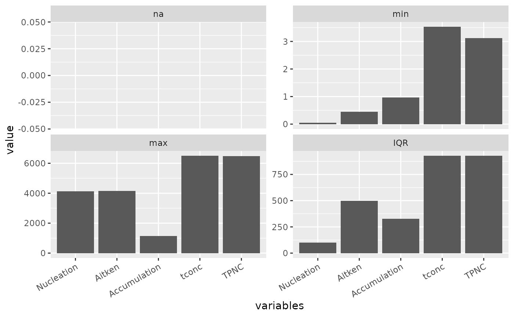
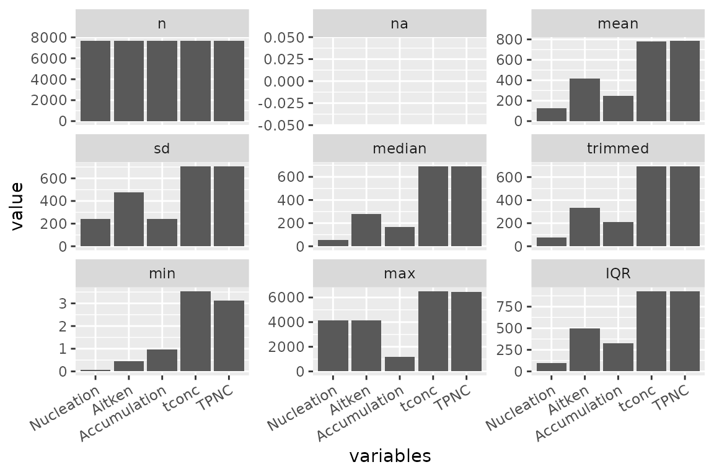
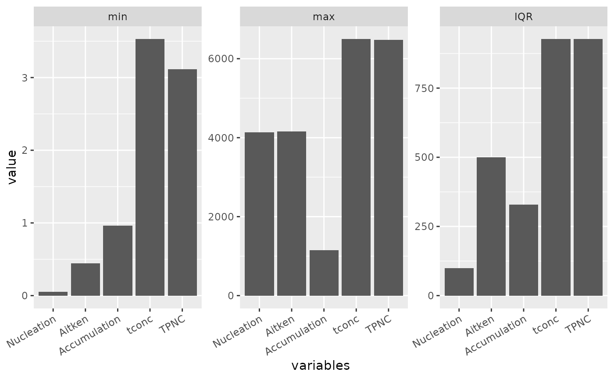
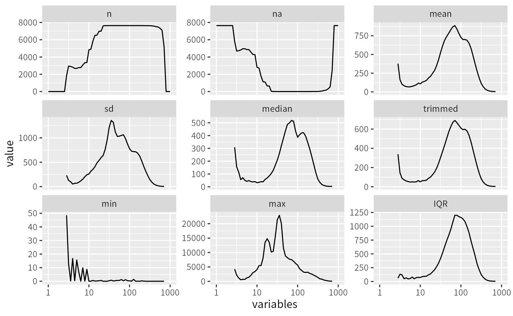
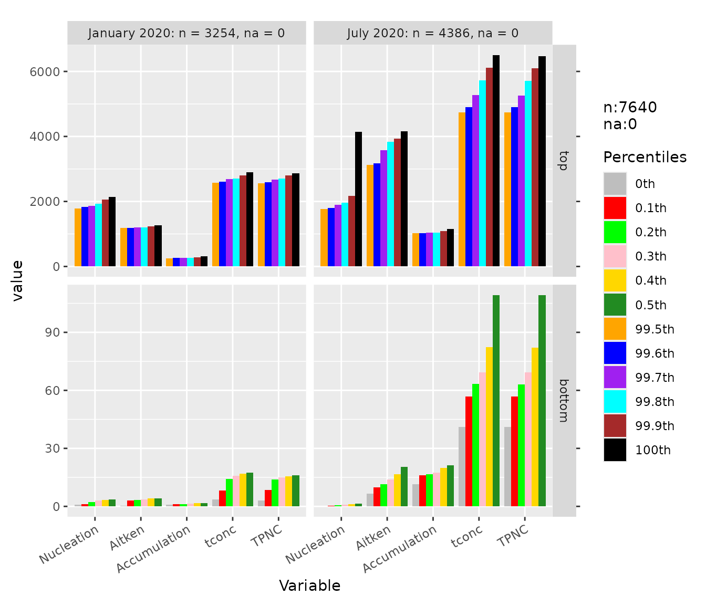
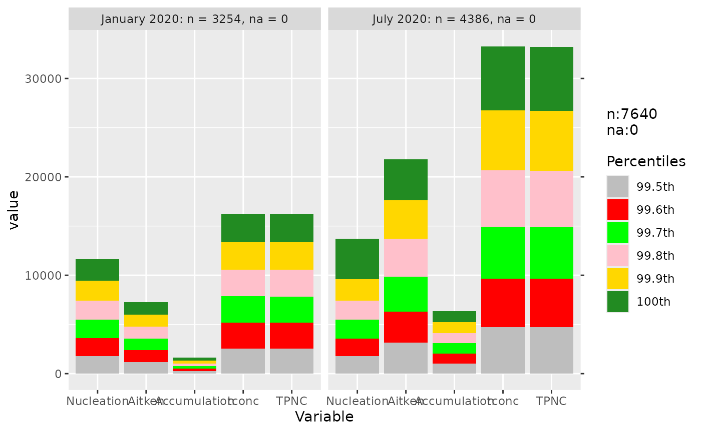
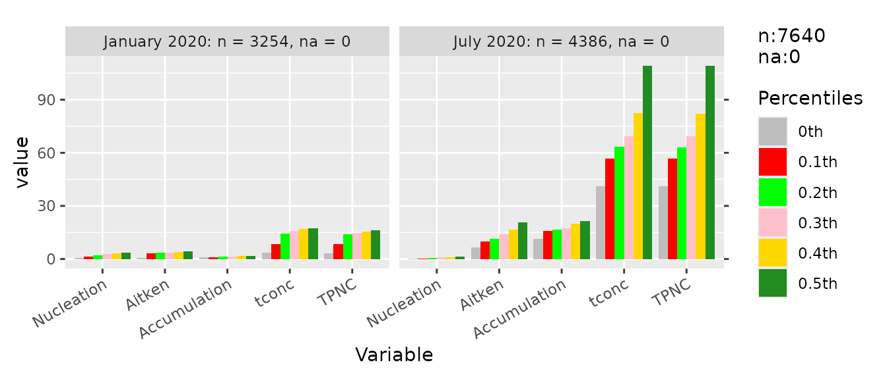
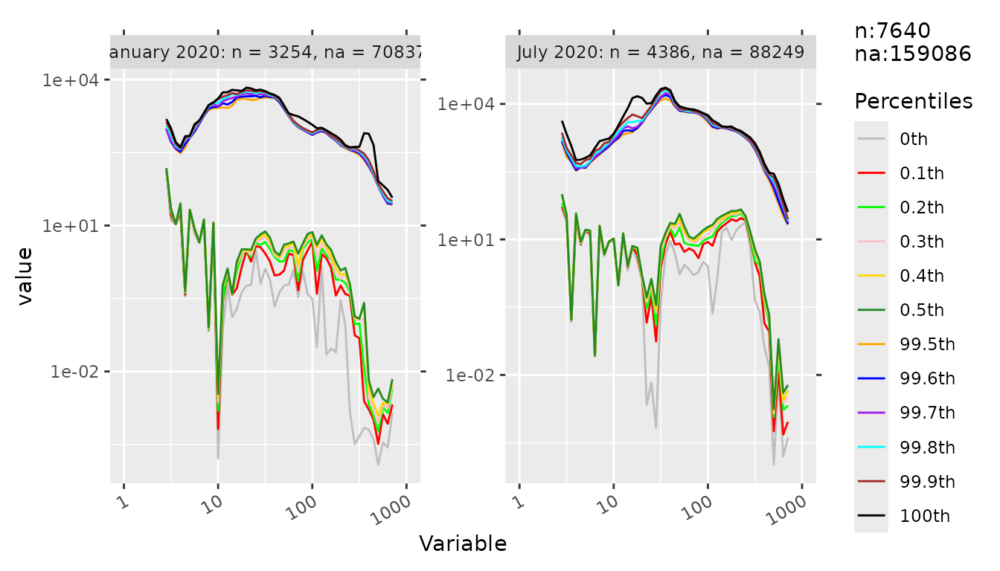
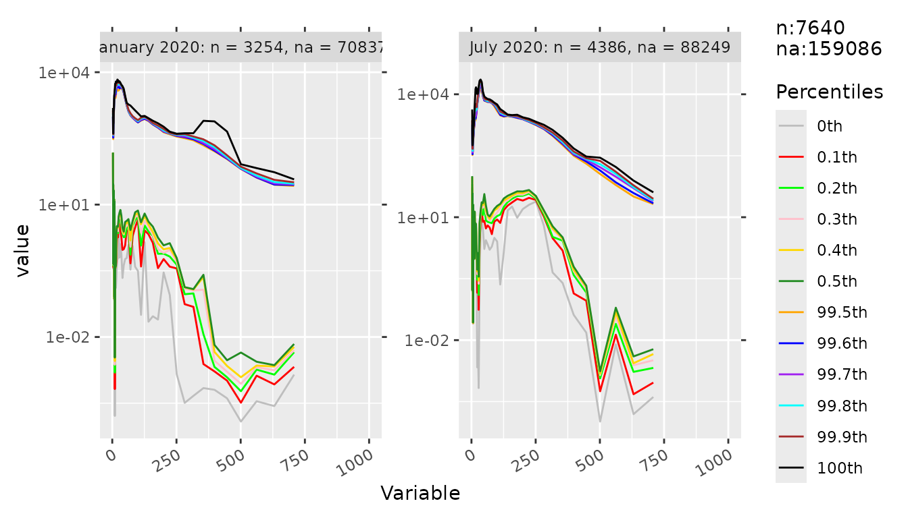
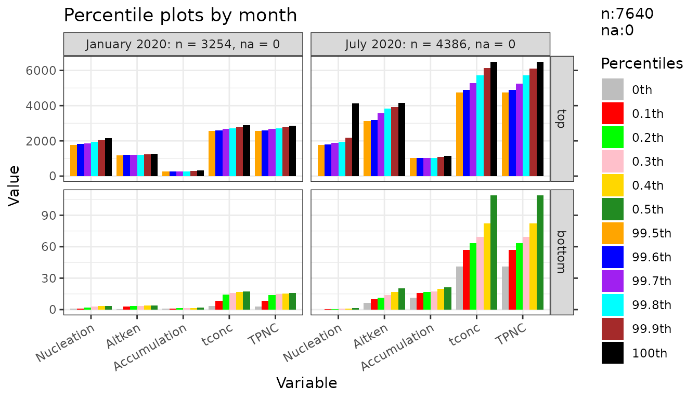

# dataprep: descriptive statistics and diagnostic plots

``` r

library(dataprep)
library(ggplot2)
```

## Overview

`dataprep` provides two families of plotting helpers, both built on top
of the C++ descriptive backends:

- **[`descplot()`](https://chunshengliang.github.io/dataprep/reference/descplot.md)**
  — descriptive statistics (`n`, `na`, `mean`, `sd`, `median`,
  `trimmed`, `min`, `max`, `IQR`) computed in C++ and displayed as line
  or bar charts.

- **[`percplot()`](https://chunshengliang.github.io/dataprep/reference/percplot.md)**
  — top and bottom percentile summaries, useful for detecting heavy
  tails and percentile-based outlier cutoffs. The geometry depends on
  the column names: lines when they are numeric, grouped bars otherwise.

Both share the same interface style: a data frame, a numeric range, and
optional grouping. Use `data1` (7,640 rows × 7 columns) for quick demos,
and `data` (7,640 × 65) for full-size examples.

Under the hood,
[`descplot()`](https://chunshengliang.github.io/dataprep/reference/descplot.md)
calls
[`descdata()`](https://chunshengliang.github.io/dataprep/reference/descdata.md)
(which calls `desc_stats_cpp()`), and
[`percplot()`](https://chunshengliang.github.io/dataprep/reference/percplot.md)
calls
[`percdata()`](https://chunshengliang.github.io/dataprep/reference/percdata.md)
(which calls [`quantile()`](https://rdrr.io/r/stats/quantile.html) from
base R on each column). Both return a `ggplot` object, so all usual
`ggplot2` layers apply.

## Descriptive statistics

### Line plot, numeric variable names

When variable names are essentially numeric (e.g. particle diameters
such as 3.16, 3.55, …),
[`descplot()`](https://chunshengliang.github.io/dataprep/reference/descplot.md)
draws a line plot with a log-scaled x axis.

``` r

descplot(data1, cols = 3:7) +
  ggplot2::theme(axis.text.x = ggplot2::element_text(angle = 30, hjust = 1))
```


### Selected statistics

Pass a subset of statistics by index or by name to focus the plot.

``` r

descplot(data1, cols = 3:7,
         stats = c("na", "min", "max", "IQR")) +
  ggplot2::theme(axis.text.x = ggplot2::element_text(angle = 30, hjust = 1))
```



The `stats` argument accepts both forms — numeric indices (`1:9`) and
character names (`"na"`, `"min"`, `"max"`, `"IQR"`) — and can mix them.

### Bar chart, character variable names

When variable names are character (e.g. aerosol mode names `Nucleation`,
`Aitken`, `Accumulation`),
[`descplot()`](https://chunshengliang.github.io/dataprep/reference/descplot.md)
falls back to a bar chart.

``` r

descplot(data1, cols = 3:7) +
  ggplot2::theme(axis.text.x = ggplot2::element_text(angle = 30, hjust = 1))
```



### Control facet layout

``` r

descplot(data1, cols = 3:7, stats = c("min", "max", "IQR")) +
  ggplot2::theme(axis.text.x = ggplot2::element_text(angle = 30, hjust = 1))
```



### Full-size data

``` r

descplot(data, cols = 5:65)
#> Warning: Removed 84 rows containing missing values or values outside the scale range
#> (`geom_line()`).
```



### The underlying table

If you only need the numbers (not the plot), call
[`descdata()`](https://chunshengliang.github.io/dataprep/reference/descdata.md)
directly. It returns a data frame with one row per variable and one
column per statistic.

``` r

descdata(data1, cols = 3:7, stats = c(2, 3, 4, 7:9))
#>      variables na     mean       sd        min      max      IQR
#> 1   Nucleation  0 123.8971 240.3190 0.05491765 4137.091  99.1508
#> 2       Aitken  0 414.8573 477.1444 0.44507100 4159.520 500.0387
#> 3 Accumulation  0 244.5512 242.2446 0.96263700 1154.862 328.2945
#> 4        tconc  0 783.0922 706.7581 3.52890000 6495.960 926.9235
#> 5         TPNC  0 783.3057 706.7105 3.11677730 6474.645 927.0629
```

## Percentile plots

### Full percentile range

[`percplot()`](https://chunshengliang.github.io/dataprep/reference/percplot.md)
computes the extreme percentiles (0 to 0.5 and 99.5 to 100 by default)
and draws them against the variable axis. This is the visual companion
to
[`condextr()`](https://chunshengliang.github.io/dataprep/reference/condextr.md)
and
[`percoutl()`](https://chunshengliang.github.io/dataprep/reference/percoutl.md).

``` r

percplot(data1, cols = 3:7, group = 2) +
  ggplot2::theme(axis.text.x = ggplot2::element_text(angle = 30, hjust = 1))
```



### Top percentiles only

``` r

percplot(data1, cols = 3:7, group = 2, part = "top") +
  ggplot2::theme(axis.text.x = ggplot2::element_text(angle = 30, hjust = 1))
```



### Bottom percentiles only

``` r

percplot(data1, cols = 3:7, group = 2, part = "bottom") +
  ggplot2::theme(axis.text.x = ggplot2::element_text(angle = 30, hjust = 1))
```



### Percentile curves of the raw data

When the column names are numeric,
[`percplot()`](https://chunshengliang.github.io/dataprep/reference/percplot.md)
draws curves instead of bars. The 61 size-bin columns of `data`
(`cols = 5:65`) have numeric names, so the default `num_xaxis = "auto"`
selects a log-scaled x axis:

``` r

percplot(data, cols = 5:65, group = 4) +
  ggplot2::theme(axis.text.x = ggplot2::element_text(angle = 30, hjust = 1))
#> Warning: Removed 288 rows containing missing values or values outside the scale range
#> (`geom_line()`).
```



### Numeric axis control

For numeric variable names, the x axis can be forced to linear scale
with `num_xaxis = "numeric"`.

``` r

percplot(data, cols = 5:65, group = 4, num_xaxis = "numeric") +
  ggplot2::theme(axis.text.x = ggplot2::element_text(angle = 30, hjust = 1))
#> Warning: Removed 288 rows containing missing values or values outside the scale range
#> (`geom_line()`).
```



The `num_xaxis` argument controls how the x axis is treated when column
names are numeric:

- `"auto"` (default) — uses a log scale if the column names are evenly
  spaced on a log scale with a range ratio of at least 1000; otherwise
  keeps them as factor levels.
- `"log"` / `"numeric"` — force the corresponding scale.
- `"character"` / `"factor"` / `"keep"` / `FALSE` — keep the column
  names as factor levels.

### The underlying table

[`percdata()`](https://chunshengliang.github.io/dataprep/reference/percdata.md)
returns the same table that
[`percplot()`](https://chunshengliang.github.io/dataprep/reference/percplot.md)
draws.

``` r

percdata(data1, cols = 3:7, group = 2, part = "top")
#>       monthyear percentile Nucleation   Aitken Accumulation    tconc     TPNC
#> 1  January 2020     99.5th   1776.874 1177.590     251.2686 2570.553 2564.096
#> 2  January 2020     99.6th   1831.310 1193.524     258.8365 2602.852 2598.483
#> 3  January 2020     99.7th   1865.419 1197.455     264.1341 2682.432 2677.426
#> 4  January 2020     99.8th   1932.728 1209.706     268.3745 2707.422 2710.492
#> 5  January 2020     99.9th   2057.681 1226.880     281.9808 2809.065 2806.129
#> 6  January 2020      100th   2144.838 1260.049     320.1226 2892.800 2863.144
#> 7     July 2020     99.5th   1759.576 3131.918    1020.8168 4746.214 4735.106
#> 8     July 2020     99.6th   1804.914 3176.623    1025.4474 4904.231 4904.169
#> 9     July 2020     99.7th   1899.484 3568.876    1032.8527 5269.146 5260.941
#> 10    July 2020     99.8th   1955.395 3829.049    1043.0213 5729.433 5712.250
#> 11    July 2020     99.9th   2168.298 3931.558    1093.4650 6120.315 6102.260
#> 12    July 2020      100th   4137.091 4159.520    1154.8621 6495.960 6474.645
```

## Combining with `ggplot2`

Both
[`descplot()`](https://chunshengliang.github.io/dataprep/reference/descplot.md)
and
[`percplot()`](https://chunshengliang.github.io/dataprep/reference/percplot.md)
return `ggplot` objects, so all usual `ggplot2` layers apply.

``` r

percplot(data1, cols = 3:7, group = 2) +
  ggplot2::theme_bw(base_size = 11) +
  ggplot2::labs(title = "Percentile plots by month",
                x = "Variable", y = "Value") +
  ggplot2::theme(axis.text.x = ggplot2::element_text(angle = 30, hjust = 1))
```



## A diagnostic workflow

A typical diagnostic workflow combines
[`data_report()`](https://chunshengliang.github.io/dataprep/reference/data_report.md),
[`na_diagnose()`](https://chunshengliang.github.io/dataprep/reference/na_diagnose.md),
and the two plot families:

``` r

# 1. Overview of the whole table
data_report(data, cols = 5:65)

# 2. Per-column NA run statistics
na_diagnose(data, cols = 5:65)

# 3. Descriptive statistics of the raw data
descplot(data, cols = 5:65)

# 4. Percentile curves of the raw data
percplot(data, cols = 5:65, group = 4)
```

After running
[`dataprep()`](https://chunshengliang.github.io/dataprep/reference/dataprep.md)
you can compare the raw and cleaned versions in the same plot by
stacking them with a `g` column:

``` r

cleaned <- dataprep(data, cols = 5:65, group = 4)

percplot(
  rbind(
    transform(data[names(cleaned)], g = "original"),
    transform(cleaned,              g = "preprocessed")
  ),
  cols  = 5:ncol(cleaned),
  group = ncol(cleaned) + 1
)
```

## Where to go next

- **Design philosophy** —
  [`vignette("dataprep-philosophy")`](https://chunshengliang.github.io/dataprep/articles/dataprep-philosophy.md).
  Why the cleaning pipeline has the shape it does.

- **Cleaning pipeline walkthrough** —
  [`vignette("dataprep-cleaning")`](https://chunshengliang.github.io/dataprep/articles/dataprep-cleaning.md).
  Step-by-step execution of the four cleaning steps on `data`.

- **Performance and cross-engine consistency** —
  [`vignette("dataprep-performance")`](https://chunshengliang.github.io/dataprep/articles/dataprep-performance.md).
  Benchmark tables and 8-engine consistency checks.

- **Upgrading from 0.1.5 to 0.1.7** —
  [`vignette("dataprep-migration")`](https://chunshengliang.github.io/dataprep/articles/dataprep-migration.md).
  Behaviour changes and the migration checklist.

- **Fast reshaping** —
  [`vignette("dataprep-melt-dcast")`](https://chunshengliang.github.io/dataprep/articles/dataprep-melt-dcast.md).

## Session info

``` r

sessionInfo()
#> R version 4.6.1 (2026-06-24)
#> Platform: x86_64-pc-linux-gnu
#> Running under: Ubuntu 24.04.5 LTS
#> 
#> Matrix products: default
#> BLAS:   /usr/lib/x86_64-linux-gnu/openblas-pthread/libblas.so.3 
#> LAPACK: /usr/lib/x86_64-linux-gnu/openblas-pthread/libopenblasp-r0.3.26.so;  LAPACK version 3.12.0
#> 
#> locale:
#>  [1] LC_CTYPE=C.UTF-8       LC_NUMERIC=C           LC_TIME=C.UTF-8       
#>  [4] LC_COLLATE=C.UTF-8     LC_MONETARY=C.UTF-8    LC_MESSAGES=C.UTF-8   
#>  [7] LC_PAPER=C.UTF-8       LC_NAME=C              LC_ADDRESS=C          
#> [10] LC_TELEPHONE=C         LC_MEASUREMENT=C.UTF-8 LC_IDENTIFICATION=C   
#> 
#> time zone: UTC
#> tzcode source: system (glibc)
#> 
#> attached base packages:
#> [1] stats     graphics  grDevices utils     datasets  methods   base     
#> 
#> other attached packages:
#> [1] ggplot2_4.0.3  dataprep_0.1.7
#> 
#> loaded via a namespace (and not attached):
#>  [1] gtable_0.3.6       jsonlite_2.0.0     dplyr_1.2.1        compiler_4.6.1    
#>  [5] tidyselect_1.2.1   Rcpp_1.1.2         parallel_4.6.1     jquerylib_0.1.4   
#>  [9] systemfonts_1.3.2  scales_1.4.0       textshaping_1.0.5  yaml_2.3.12       
#> [13] fastmap_1.2.0      R6_2.6.1           labeling_0.4.3     generics_0.1.4    
#> [17] knitr_1.52         tibble_3.3.1       desc_1.4.3         bslib_0.12.0      
#> [21] pillar_1.11.1      RColorBrewer_1.1-3 rlang_1.3.0        cachem_1.1.0      
#> [25] xfun_0.61          fs_2.1.0           sass_0.4.10        S7_0.2.2          
#> [29] otel_0.2.0         cli_3.6.6          withr_3.0.3        pkgdown_2.2.1     
#> [33] magrittr_2.0.5     digest_0.6.39      grid_4.6.1         lifecycle_1.0.5   
#> [37] vctrs_0.7.3        evaluate_1.0.5     glue_1.8.1         farver_2.1.2      
#> [41] ragg_1.5.2         rmarkdown_2.32     tools_4.6.1        pkgconfig_2.0.3   
#> [45] htmltools_0.5.9
```
