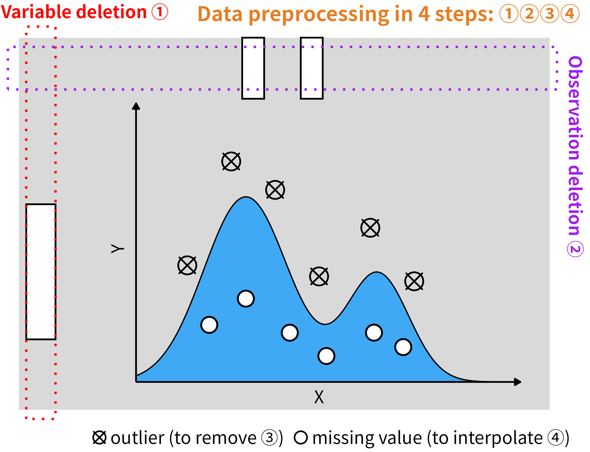
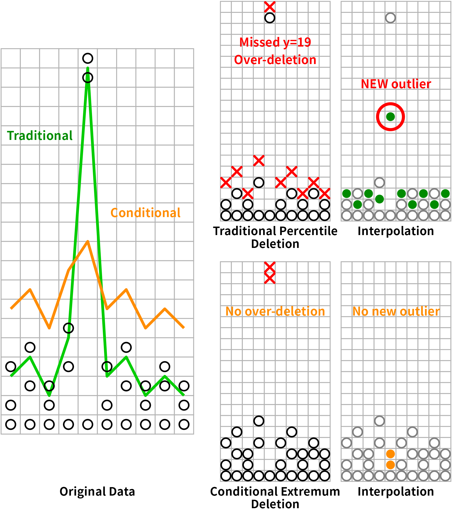
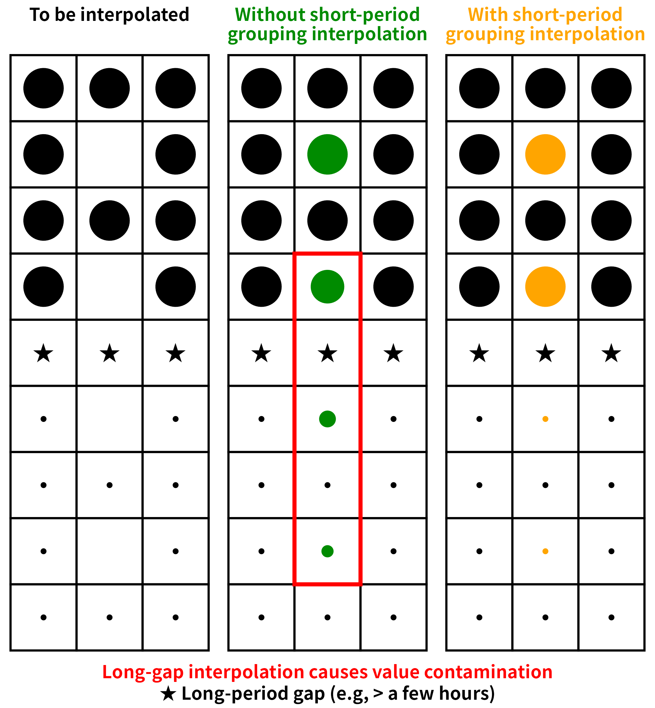

```{r, include = FALSE}
knitr::opts_chunk$set(
  collapse  = TRUE,
  comment   = "#>",
  fig.align = "center",
  fig.width = 7,
  fig.height = 4.5
)
```

```{r setup}
library(dataprep)
```

## The problem this package solves

Preprocessing high-resolution instrument data is not a pipeline you
can assemble from a grab-bag of one-shot functions. The order in
which steps are applied, and the physical constraints each step
enforces, determine whether the final table is meaningful. A
percentile filter applied before gap detection will delete a
legitimate extreme before anyone notices it sits in a 6-hour hole.
A linear interpolation run before observation deletion will
silently blend two physically distinct regimes into a value that
does not exist in nature.

`dataprep` is built around a specific claim: **the reliability of a
substituted value is bounded by the time distance to its nearest
observed anchor.** Every design decision below follows from that
claim.

## The four-step pipeline

{width=95%}

The pipeline processes every numeric channel in this fixed order:

1. **Variable deletion** (`varidele`) — drop columns that cannot
   be reliably interpolated.
2. **Observation deletion** (`obsedele`) — drop rows whose
   remaining gaps are too long to bridge.
3. **Conditional extremum outlier removal** (`condextr`) — remove
   individual points that lie outside the local distribution.
4. **Short-period grouping interpolation** (`shorvalu`) — fill the
   remaining gaps, but only within short segments.

All four steps are wrapped by `dataprep()` for one-call use:

```
varidele()  →  obsedele()  →  condextr()  →  shorvalu()
```

Steps 2 and 3 are re-applied in alternating rounds (`interval`
rounds of marking, then one round of deletion, repeated `times`
times). The reasoning behind the ordering is in the sections
below.

## Variable deletion: three principles

The variable-deletion step is not a simple "drop columns with too
many NAs" filter. Three criteria must be reconciled:

### 1. Signal-to-noise ratio as the primary threshold

A size bin carries information only if it has enough observations
to support a reliable signal-to-noise estimate. A column that is
missing more than `fraction` of the time cannot support such an
estimate, and `varidele()` removes it before downstream steps have
to waste effort on it. The default `fraction = 0.25` reflects the
empirical observation that a channel missing a quarter of its
samples has a noise floor comparable to its signal.

### 2. Physical relevance

Not every channel that passes the NA filter is worth keeping. In
size-resolved aerosol data, a channel dominated by inlet
transmission cutoffs or near-zero counts contributes noise, not
signal. `varidele()` handles the missing-fraction case; the
companion functions `filter_low_var()`, `filter_high_cor()`, and
`phys_filter()` handle the physical and statistical cases that
`varidele()` cannot. Together they cover variable selection as a
whole.

### 3. Missing-run length, not just missing fraction

A channel with 5% missing data scattered as isolated points is
perfectly usable. A channel with 5% missing data clustered into one
four-hour gap is not — after deletion and interpolation, that
channel contributes one long unanchored stretch to the pipeline.
`varidele()` measures the missing fraction, but the actual decision
is enforced by `obsedele()` on run length rather than on fraction.
Variable deletion exists so that a column that cannot pass the
run-length criterion does not silently lower the quality of the
interpolation step.

## Observation deletion: two principles

`obsedele()` removes rows, but the physical motivation is the same
as for variable deletion: **a value can only be reliably
interpolated if there is an observed anchor close enough to
support it.**

### 1. Detect the pattern, don't filter the points

The step does not ask "does this value look like an outlier?" It
asks "does this row have a trustworthy anchor within `half` minutes
on at least one side, in every selected column?" A row fails this
test if **any** selected column has a missing run longer than
`half` minutes on **both** sides. This is a structural check, not a
value-based one — outliers are handled by the next step.

### 2. The half-hour window is the physical mixing time

Why `half = 30` minutes? For well-mixed aerosol near the surface, a
half-hour is short enough that the surrounding observations still
describe the same air mass; longer than that, and two sides of the
gap can belong to different emissions regimes or different boundary
layer states. The window is implemented symmetrically: **both**
sides of the gap must be longer than `half` minutes for the row to
be deleted. If a valid anchor exists on either side within `half`,
the row is retained.

### How it is implemented: anchor-based scan

The 0.1.6 C++ backend (`obsedele_cpp`) implements the criterion
directly, with an **anchor-based scan**. The algorithm for one
subset (a group, or a time period between two gaps) and one column
is:

1. Walk the subset in chronological order. Record the position of
   every non-missing value; these are the **anchors**.
2. For every missing value, compute two numbers:
   * `dl` — the time distance to the nearest anchor on the **left**,
   * `dr` — the time distance to the nearest anchor on the **right**.
3. Delete the row only if `dl > half_seconds` **and**
   `dr > half_seconds`.

If a side has no anchor at all (the run touches the subset
boundary), the corresponding distance is `+Inf`, so a row at the
series boundary is deleted only when the surviving side is also
beyond `half`.

This is mathematically identical to the running-mean criterion used
in earlier releases, but the algorithm has three practical
advantages:

* **O(n) time, O(1) extra allocation per column.** The 0.1.5 grid
  expansion allocated an `L`-point vector per subset, where `L` is
  the number of grid points, not the number of observations. For
  10-minute sampling on a 1-minute grid, `L` is roughly 10× the
  observation count. The anchor scan never materialises a grid.
* **Runs at full memory bandwidth.** Both the anchor list and the
  per-row distance computation are simple sequential scans over a
  single column. This is what allows the 0.1.6 implementation to
  process the full year of SMEAR I Varrio data (49,422 rows × 61
  channels) in 20 ms, against 11.2 s in 0.1.5.
* **Scales linearly with column count.** Each column is processed
  independently, so the loop parallelises over columns with
  OpenMP without any shared mutable state.

### Implementation evolution

The retention criterion has been stable across releases, but the
implementation has improved steadily. The table below summarises
the three generations:

| Release | Strategy | Complexity |
|---|---|---|
| 0.1.0 | Borrowed running mean: expand the series onto a regular grid with `tidyr::complete()`, compute a 59-minute centred moving average on a temporary column, and use its emptiness pattern to flag long runs. | O(grid length) per subset |
| 0.1.5 | Run-length encoding: use `data.table::rleid()` and `rowid()` to collapse consecutive NAs into runs, then compare each run length to the number of grid points covered by `half` minutes. | O(n) time, O(n) temporary storage |
| 0.1.6 | Anchor scan: for each missing value, look up the nearest non-missing anchor on each side and compare the two time distances directly. No grid, no run-length state. | O(n) time, O(1) extra allocation per column |

Each generation produces the same deletion decision on the same
input, but the constant factors shrink. The 0.1.6 anchor scan is
the first version that is fast enough to run interactively on
full-year data.

### Why "both sides" and not "one side"?

A one-sided criterion would delete rows at the boundary of every
run, even when the surviving side has a valid anchor right next to
the row. The 0.1.5 implementation effectively did this by merging
columns before computing runs, which over-deleted boundary rows.
The 0.1.6 rewrite scans each column independently and requires
**both** distances to exceed `half` before deletion. See
`vignette("dataprep-migration")` for the full upgrade guide.

### Subsets: group and period

The anchor scan is applied **per subset**. A subset is one of two
things, depending on the input:

* If a `group` column is provided, each group is a subset.
* Otherwise, the timeline is split into **periods** separated by
  gaps longer than `threshold_sec` (default `half × 60` seconds).
  Repeated timestamps stay in the same period.

Subsets matter because the retention criterion is local: a row at
the end of one period must not be evaluated against an anchor that
lies on the other side of a long intra-day gap.

### Re-applied after outlier deletion

Observation deletion is applied **twice** in the pipeline: once
before outlier removal and once after. This is not a bug. Removing
outliers converts values to NA, which can create new long NA runs
that did not exist in the original data. The second pass catches
these. Without the re-application, the interpolation step would
silently extend across gaps that only appeared after outlier
removal.

## Outlier removal: two principles

{width=95%}

### 1. Per-point decisions, not one-shot thresholds

The default `condextr` method does not delete every value above the
99.5th percentile. It judges each candidate **in context**: the
current extreme point is compared against a threshold built from a
high percentile, an error margin (`top.error`, `bottom.error`), and
a magnitude margin (`top.magnitude`, `bottom.magnitude`). A value
that is a global maximum but sits well within the local
distribution of a two-modal series is retained; a value that is
locally extreme is removed even if it is not globally extreme.

This is closer to a semi-supervised decision rule than to an
unsupervised cutoff. The comparison against `percoutl` — the
traditional percentile method — is shown in the figure above. The
traditional rule clips legitimate values at both ends of the
distribution and then produces **new** outliers at the boundary
between observed and interpolated points. The conditional-extremum
rule removes only the extreme point of each window and leaves no
artificial outlier behind.

### 2. Outlier deletion inherits the gap-length constraint

Every value removed by `condextr` becomes an `NA`. If a column had
a short NA run before outlier removal, and outlier removal punches
holes through the interior of the series, the resulting NA run can
be much longer than the original. This is why `obsedele` is
re-applied immediately after `condextr` in every round of the
`condextr` loop.

The loop structure is:

```
for round in 1..times:
    for i in 1..interval:
        mark outliers in every column
    delete observations whose NA runs now exceed half
```

`interval` controls how aggressively `condextr` marks points
between two observation-deletion rounds; `times` controls how many
rounds the loop runs. Both are exposed as arguments in
`dataprep()` and can be tuned by `optisolu()` when a
ground-truth-like reference (`percoutl`) is available.

## Missing-value interpolation: two principles

{width=95%}

### 1. Vertical, not horizontal

The most important design decision in the interpolation step is
that `shorvalu()` interpolates **within a column along time**,
never **across columns at the same time point**.

The reason is physical. Size-resolved aerosol measurements are
strongly non-stationary in the size dimension: a nucleation burst
shifts the entire distribution toward small diameters for an hour
or two, then decays. Interpolating a missing value in the 7.94 nm
channel from its neighbours in the 6.31 and 8.91 nm channels
silently assumes that the shape of the distribution is constant
over the gap — an assumption that fails exactly when the
measurement matters. Horizontal interpolation therefore tends to
**create new outliers** at the segment boundaries, which are then
flagged as outliers by the next round and deleted, in a cycle that
silently erodes the sample size.

Vertical interpolation uses only observations of the same physical
quantity. It has no hidden stationarity assumption beyond the local
one enforced by the half-hour window.

### 2. Segment the series before interpolating

Naive time-series interpolation runs a continuous interpolator
across the entire gap, no matter how long it is. This silently
mixes two physically distinct regimes and produces **values that do
not exist in nature** — a smoothed average of two different air
masses, attributed to a time point that belonged to neither.

`shorvalu()` splits each series into short segments separated by
gaps longer than `intervals` minutes, and interpolates within each
segment **independently**. The right panel of the figure above
shows the result: the interpolated values (orange) are drawn from
the segment's own anchors, not from across the gap. The middle
panel shows the naive alternative, where the interpolation
contaminates the whole gap.

**This internal segmentation does not depend on the upstream
cleaning step.** Even if `obsedele()` were skipped entirely,
`shorvalu()` would still cut the series at every long gap and
interpolate within each segment only. The two mechanisms are
complementary, not redundant:

* **Upstream cleaning (`obsedele`)** is a *preventive* measure. It
  removes rows with long NA runs, which reduces the number of
  segments `shorvalu()` has to handle and preserves more sample
  rows on the "keep" side of the trade-off.
* **Internal segmentation (`shorvalu`)** is a *defensive* measure.
  It guarantees correctness at the function level, regardless of
  what the caller did before.

This is what "**short-period grouping interpolation**" means:
interpolation is applied only where the value can be read from a
nearby observation in the same segment.

## Why this order, and not any other

| Order | Consequence |
|---|---|
| `shorvalu` before `obsedele` | Interpolation crosses long gaps; new outliers appear at segment boundaries. |
| `condextr` before `varidele` | Outliers are detected within columns that will later be dropped; wasted effort, and parameters tuned against the wrong sample. |
| `obsedele` before `condextr` | Correct: anchors are guaranteed before outlier decisions, so `condextr` judges each candidate against a meaningful local distribution. |
| One pass of `obsedele` only | NA runs created by outlier removal are not detected; `shorvalu` silently extends across gaps that did not exist in the input. |
| Horizontal interpolation | Creates new outliers at every gap; the next round of outlier detection deletes them, eroding the sample. |

The fixed order is `varidele` → (`obsedele` → `condextr`) ×
`times` → `shorvalu`. Every wrapper in the package respects this
order:

* `prep_fit()` and `prep_transform()` enforce it across train/test
  splits.
* `dataprep()` chains **all four steps** for one-call use.
* `dry_run()` reports the effect of each step without modifying the
  caller's data.

## Evaluation metrics

The pipeline is a constraint-satisfaction procedure with four
measurable outcomes. Every parameter choice in `dataprep()` and
`optisolu()` is judged against these:

### Number of values deleted

The total count of values set to `NA` by `varidele`, `obsedele`,
and `condextr`, in units of original observations. `dry_run()`
reports `na_before`, `na_after`, and the difference for each step.

### Sample retention

The number of rows that survive the cleaning pipeline, divided by
the input row count. On the SMEAR I Varrio 2025 full-year dataset
this is 46,063 / 49,422 ≈ **93.2%** after the default settings.

### Residual outliers

Values that survive the pipeline and are still outliers by any
external criterion. `optisolu()` uses `percoutl` as the reference:
a candidate parameter combination is considered "better" only if it
produces strictly fewer residual outliers than the traditional
method at the same outlier-removal ratio.

### Newly created outliers

Values that did not exist in the input but appear in the output as
a direct consequence of an earlier step (interpolation,
imputation, or scaling). This is the metric on which horizontal
interpolation fails most visibly; it is one of the reasons
`shorvalu` is restricted to vertical, short-period interpolation.

### Uncertainty analysis

For each output column, the standard deviation of the cleaned
series is compared against (a) the input series, and (b) the output
of the previous release. A large change in standard deviation
indicates that a step has shifted the distribution rather than
merely denoising it, and is a signal to re-examine the parameter
choices. `optisolu()` exposes this comparison through the `snr`
column of its return value.

## The package beyond the four steps

The four-step pipeline is the core of `dataprep`, but the package
ships a wider toolkit. Every function operates on a data frame (or
matrix, or plain vector where it makes sense), follows a consistent
argument convention (`data`, `cols`, `group`, `verbose`), and is
implemented either in C++ or in R on top of a small set of shared
helpers (`resolve_numeric_cols()`, `to_numeric_matrix()`,
`check_numeric_cols()`). This is what makes the package usable as
a general-purpose data-frame preprocessing layer, not just a
specialist tool for one dataset.

The helper families are:

* **Cleaning** — `varidele`, `obsedele`, `condextr`, `percoutl`,
  `detect_outliers`, `winsorize`, `phys_filter`, `filter_high_cor`,
  `filter_low_var`, `deduplicate`, `validate_data`,
  `balance_panel`.
* **Missing values** — `na_diagnose`, `impute_missing`, `shorvalu`.
* **Transformation** — `transform_data`, `log_returns`,
  `bin_data`, `encode_categorical`, `zerona`.
* **Time series** — `create_lags`, `roll_apply`, `resample_time`,
  `detrend_ts`, `remove_diurnal_cycle`, `decompose_ts`,
  `drift_detect`, `day_night_flag`, `season_flag`.
* **Reshaping** — `melt`, `dcast`.
* **Reporting and workflow** — `descdata`, `descplot`, `percdata`,
  `percplot`, `data_report`, `dry_run`, `prep_fit`,
  `prep_transform`, `sample_data`.

Each function is documented on its own help page. This vignette
explains *why* the pipeline has the shape it does; the help pages
explain *how* each function is called.

## Related documentation

* **Cleaning pipeline walkthrough** — `vignette("dataprep-cleaning")`.
  Step-by-step execution on a real dataset.
* **Performance and cross-engine consistency** —
  `vignette("dataprep-performance")`. Benchmark tables and
  8-engine consistency checks.
* **Upgrading from 0.1.5 to 0.1.6** —
  `vignette("dataprep-migration")`. Behaviour changes and the
  migration checklist.
* **Leakage-free workflow** — `vignette("dataprep-workflow")`.
  `prep_fit()` / `prep_transform()` in practice.
* **Fast reshaping** — `vignette("dataprep-melt-dcast")`.

## Funding

This work was supported by the National Natural Science Foundation 
of China (No. 12301674).

## Session info

```{r}
sessionInfo()
```
